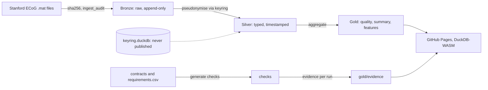

# ecog-lakehouse

[](https://github.com/MrBisonte/ecog-lakehouse/actions/workflows/ci.yml)

A lakehouse over public brain recordings: 42 files from the Stanford ECoG (electrocorticography) library, 2,241 channels, 860 million samples, stored as Parquet and built with DuckDB.

It exists to try three ideas on real data.

| Idea | In one line |
|---|---|
| Checks written from regulation text | A CSV row names a clause. The build turns it into SQL and keeps the result as evidence. |
| An identifier you can decode | Every row carries 128 bits that say which file, run and channel it came from. |
| Faults planted on purpose | Four known performance mistakes, each with its fix and a measurement. |

**See it running:** https://mrbisonte.github.io/ecog-lakehouse/

The page is static. DuckDB-WASM loads the published files, reruns 67 checks in your browser and verifies the file digests there.

## Try it

```bash
git clone https://github.com/MrBisonte/ecog-lakehouse && cd ecog-lakehouse
python -m venv .venv && source .venv/bin/activate
pip install -e ".[dev]"
make all SYNTH=1
make test
```

- Needs Python 3.12 or later and `make`, on Linux, macOS or WSL.
- `SYNTH=1` builds on generated data, in about a minute. No download.
- Data goes to `$HOME/data/ecog-lakehouse`, never into the checkout. Set `DATA_DIR` to change it.
- `make all` ends with `make publish`, which overwrites `docs/data/gold` with your build. `git checkout docs/data && git clean -fd docs/data` restores the published copy.

For the real recordings, 2 GB:

```bash
make fetch && make all
```

## How it works



| Layer | What it holds | Rule |
|---|---|---|
| Bronze | Raw samples, one row each, with the hash of their file | Never rewritten |
| Silver | Microvolts, milliseconds, pseudonyms | No source subject code past this point |
| Gold | Channel quality, experiment summary, one second windows, evidence | Every value is a query result |

## Checks

```
requirements.csv  ──►  generator  ──►  SQL checks  ──►  evidence rows
(Part 11, GDPR Art. 9,  (one per row)   (8 kinds)        (pass, fail or error, with
 ALCOA+, ISO 13485)                                       dataset version, engine, commit)
```

- A new regulation is new rows in the CSV. No code changes.
- The mapping of clauses to checks is illustrative and has not been reviewed by a compliance professional.
- The data contracts feed the same generator.
- The last build ran 111 checks.
- The same files always give the same `dataset_version`, so evidence can be reproduced.

[One check followed end to end, and why the generator is hand-written](adr/ADR-0006.md).

## Lineage identifier

```
 ts_ms(48) | layer(4) | experiment(8) | file(16) | run(4) | channel(10) | segment(10) | reserved(28)
```

One id per record, in the ULID layout. The 80 bits after the timestamp hold the hierarchy.

```
 file ──► Bronze lid ──► Silver lid ──► Gold lid + sample range
   ▲                                          │
   └────────────── lid_trace (bit shift) ─────┘
```

| Question | How it is answered |
|---|---|
| Which file did this Gold number come from? | `lid_trace`: decode the bits, one lookup |
| What is the parent record? | `lid_parent`: the same id, layer minus one |
| Which records came from this file? | `lid_children`: a range scan on the prefix |

Integrity is separate: a sha256 per file and a digest per dataset version.

## Planted faults

Each fault is a mistake built on purpose, beside its fix. Times are medians of three runs against GitHub Pages, from [docs/bench.md](docs/bench.md).

| Fault | The mistake | The fix | Measured |
|---|---|---|---|
| A | One giant row group | 38 sorted row groups | Fetching one record: 1.00 s to 0.58 s. Aggregating every row: 1.11 s to 2.64 s, slower |
| D | A Python loop downloads one file at a time | One `read_parquet` over all the URLs | 6.31 s to 0.33 s for 10 files |
| F | A 503 from the server kills the read | `http_retries` with backoff | 0 of 10 reads succeed, then 10 of 10 |
| G | Generated SQL nests 512 `OR`s | An `IN` list | Planning: 0.09 s to 0.04 s. The generator now refuses the nested form |

Fault A did not go as planned. The fixed layout is faster for the lookup it was designed for and slower for a full aggregate. [Why](docs/lessons-learned.md), and [issue #28](https://github.com/MrBisonte/ecog-lakehouse/issues/28) for the part still open.

Run them with `make bench`. This needs a DuckDB CLI; see `faults/lib.sh`.

## Docs

`doc/` holds the design and the contract, `docs/` the published site.

| Read | For |
|---|---|
| [docs/paper.md](docs/paper.md) | The project in one page: claims, method, results, limits, references |
| [docs/manual.md](docs/manual.md) | Running, inspecting and resetting the build |
| [docs/glossary.md](docs/glossary.md) | Every term the other pages assume, with its spec section |
| [docs/five-records.md](docs/five-records.md) | Five records followed from file to Gold, with the SQL of every step |
| [docs/lessons-learned.md](docs/lessons-learned.md) | The out of memory incident: cause, proof, and what we got wrong |
| [docs/bench.md](docs/bench.md) | Row counts and every fault measurement |
| [doc/spec.md](doc/spec.md) | The contract: every dataset, column and rule |
| [adr/](adr/README.md) | Six decisions, each with the options rejected |
| [CONTRIBUTING.md](CONTRIBUTING.md) | How to propose a change |

## Limits

- Public data only.
- No published file over 95 MB; `docs/data` stays under 500 MB.
- The page loads DuckDB-WASM from a pinned CDN version. It makes no other third-party request.
- The unit scale of `faces_basic` is not documented by its source. Those rows are marked `scale_basis = assumed`.

## Acknowledgements

The recordings are the work of Kai J. Miller and the patients who took part. Citations, the paper of each experiment and the ethics statements are in [docs/data/LICENSE.md](docs/data/LICENSE.md) and, machine readable, in [CITATION.cff](CITATION.cff).

The code is a thin layer over other people's work:

|Project|Licence|Used for|
|---|---|---|
|[Stanford ECoG library](https://purl.stanford.edu/zk881ps0522), Kai J. Miller|CC BY-SA 4.0|Every recording: `fingerflex`, `motor_basic`, `faces_basic`|
|[DuckDB](https://github.com/duckdb/duckdb)|MIT|The engine of every layer, every check and every bench; the 2.0 alpha CLI and the `httpfs` extension for the fault benches|
|[DuckDB-WASM](https://github.com/duckdb/duckdb-wasm)|MIT|The checks rerun in the browser, loaded from jsDelivr at a pinned version|
|[SciPy](https://github.com/scipy/scipy)|BSD-3-Clause|Reading MATLAB `.mat` files, the FFT behind `line_noise_ratio`|
|[NumPy](https://github.com/numpy/numpy)|BSD-3-Clause|The arrays between the `.mat` files and DuckDB|
|[PyYAML](https://github.com/yaml/pyyaml)|MIT|Reading the data contracts|
|[pytest](https://github.com/pytest-dev/pytest)|MIT|The test suite. Development only|
|[Ruff](https://github.com/astral-sh/ruff)|MIT|Linting. Development only|
|[cyclonedx-python](https://github.com/CycloneDX/cyclonedx-python)|Apache-2.0|`make sbom`. Development only|

Standards followed: [Open Data Contract Standard](https://github.com/bitol-io/open-data-contract-standard) v3 for the contracts, the [ULID specification](https://github.com/ulid/spec) and Crockford base32 for the shape and text form of `lid`, [Citation File Format](https://citation-file-format.github.io/) 1.2.0, [REUSE](https://reuse.software/) for licensing, [CycloneDX](https://cyclonedx.org/) 1.6 for the bill of materials in [sbom.cdx.json](sbom.cdx.json), regenerated by `make sbom`.

## Licence

Code: MIT, [LICENSE](LICENSE). Published data under `docs/data/`: CC BY-SA 4.0, [docs/data/LICENSE.md](docs/data/LICENSE.md). Both texts are in `LICENSES/`, and [REUSE.toml](REUSE.toml) states which applies to which path.
