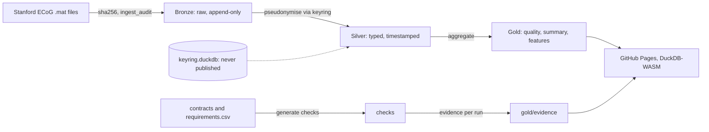

# ibrain

Governed lakehouse over public ECoG recordings. Every number traces to bytes. Four planted faults, fixed live.

## 1. Flow



| Layer | What it is | Rule |
|---|---|---|
| Bronze | Raw arrays, one row per sample, per file hash | Never rewritten |
| Silver | Microvolts, milliseconds, pseudonyms | First readable layer, no source ids |
| Gold | Channel quality, experiment summary, 1 s feature windows, evidence | Every value is a query result |

## 2. Governance that executes

```
requirements.csv  ──►  check generator  ──►  SQL checks  ──►  evidence rows
(Part 11, GDPR-9,       (one per row)        (8 kinds)        (pass / fail / error,
 ALCOA+, ISO 13485)                                            dataset_version, engine, commit)
```

Adding a framework is adding rows. Evidence is reproducible: same files, same `dataset_version`.

## 3. Lineage identifier

One 128-bit id per record, ULID shape, hierarchy in the 80 non-timestamp bits.

```
 ts_ms(48) | layer(4) | experiment(8) | file(16) | run(4) | channel(10) | segment(10) | reserved(28)
```

```
 file ──► Bronze lid ──► Silver lid ──► Gold lid + sample range
   ▲                                          │
   └────────────── lid_trace (bit shift) ─────┘
 lid_parent: same id, layer minus one.   lid_children: prefix range scan.
```

Integrity is separate: sha256 per file, digest per dataset version. Click any number on the page, see its file and hash.

## 4. Planted faults

| Fault | Symptom | Fix shown live | Payoff |
|---|---|---|---|
| A | One giant row group, unpartitioned | `COPY ... PARTITION BY ... ORDER BY` | Async I/O now has parallel streams, 3x |
| D | Python loop, one file at a time | One `read_parquet` over a remote glob | Engine read-ahead, less code |
| F | Transient 503 kills the run | `http_retries`, backoff | Runs finish |
| G | Generated SQL nests 512 `OR`s | `IN` list, generator test | Fast plan, clear parse error |

Bench: same query, before and after, `read_ahead_depth = 0` versus default, remote URL.

## 5. Demo, five minutes

```
brief on screen  →  page: evidence + tables  →  click a number: lineage  →  fault A live  →  one of D/F/G  →  close
```

Browser for governance, DuckDB 2.0 CLI for the performance A/B, two README commands to reproduce.

## 6. Boundaries

Public data only, CC BY-SA 4.0. No employer code. Files under 95 MB, total under 500 MB. No third-party request at view time.
