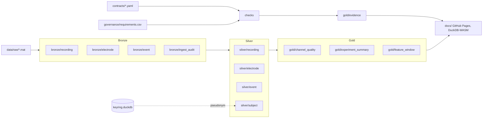

# spec.md

Working name of the repository: `brain`. Rename freely; nothing depends on it.

## 1. Scope

The system ingests recordings from the Stanford ECoG library, stores them in three layers on Parquet, enforces data contracts with checks generated from a regulatory requirements table, writes evidence for every run, and exposes the Gold layer to a browser page. Four faults are planted on purpose, each with a fix and a measurement.

## 2. Source data

The Stanford ECoG library is a set of MATLAB `.mat` files, one per subject and experiment, at 1 kHz with electrode positions registered to anatomy. Subject codes in the library are already de-identified two-letter codes. This system treats those codes as source identifiers and pseudonymises them anyway, so the mechanism is real even though the risk is not.

Experiments used, one directory each under `data/raw/<experiment>/`:

| Experiment | Behaviour | Why it is in |
|---|---|---|
| `fingerflex` | Cued individual finger movement with dataglove position | Continuous behavioural signal alongside the neural signal, the closest analogue to closed-loop therapy data |
| `motor_basic` | Cued hand and tongue movement | Event-driven task, exercises the `event` entity |
| One further experiment chosen at conversion time | | Third dimension for Silver partitioning and a Gold use case |

Adapter roadmap: `.mat` (phase 0 and 1), then NWB (`acquisition/ElectricalSeries`, `general/electrodes`, `intervals/trials` into the same Bronze schema) and BIDS-iEEG. NWB and BIDS are the formats the company's science and ML teams name; NWB's `acquisition` group carries the same rule as Bronze, raw data never changes. The NWB adapter needs `pynwb` (and with it `h5py`), an optional dependency introduced by its own ADR in phase 1, never in phase 0.

> **Note.** Field names inside the `.mat` files differ per experiment. `pipeline/convert_mat.py` holds one adapter per experiment that maps the file's arrays to the Bronze schema. An experiment without an adapter is skipped with a logged reason, never guessed.

## 3. Layers



All layers are Parquet under `data/<layer>/`, Hive partitioned. Published copies for the site and the CLI demo live under `docs/data/<layer>/` and are size-limited (see section 9).

### 3.1 Bronze

Bronze is the raw arrays, one row per sample, with no cleaning. It is append-only. A file, once written, is never modified; a re-ingestion writes a new partition with a new `ingest_id`.

#### bronze/recording

Partition: `experiment=<experiment>/subject_src=<code>/ingest_id=<id>/`.

| Column name | Column type |
|---|---|
| experiment | VARCHAR |
| subject_src | VARCHAR |
| run | SMALLINT |
| channel_idx | SMALLINT |
| sample_idx | INTEGER |
| value_raw | FLOAT |
| ingest_id | VARCHAR |
| lid | UUID |

- `experiment` is the library experiment name, for example `fingerflex`. Not NULL.
- `subject_src` is the source subject code as found in the library, for example `bp`. Not NULL. This column does not exist in Silver or Gold.
- `run` is the recording run within the experiment for that subject, starting at 1. Not NULL.
- `channel_idx` is the zero-based electrode index in the source array. Not NULL.
- `sample_idx` is the zero-based sample position at the source sampling rate. Not NULL. Timestamp in milliseconds is `sample_idx * 1000 / sample_rate_hz` and is derived in Silver, not stored here.
- `value_raw` is the amplifier value as stored in the file, in the file's units. Not NULL.
- `ingest_id` is a ULID assigned per conversion run. Not NULL. References `bronze/ingest_audit.ingest_id`.
- `lid` is the Bronze-layer lineage identifier of the record (layer 1, see section 12), computed at conversion time from the file's `ingest_ord`, `run` and `channel_idx`. Not NULL. Bronze is the first layer that carries it, so the chain is unbroken from the ingested file downward: `lid_trace` on a Bronze row returns the source path, the source URL at the Stanford repository and the sha256 recorded in `bronze/ingest_audit`.

#### bronze/electrode

Partition: `experiment=<experiment>/subject_src=<code>/`.

| Column name | Column type |
|---|---|
| experiment | VARCHAR |
| subject_src | VARCHAR |
| channel_idx | SMALLINT |
| x_mm | FLOAT |
| y_mm | FLOAT |
| z_mm | FLOAT |
| brain_area | VARCHAR |
| ingest_id | VARCHAR |
| lid | UUID |

- `x_mm`, `y_mm`, `z_mm` are electrode coordinates in millimetres in the library's registered space. NULL when the file has no location for that channel.
- `brain_area` is the library's anatomical label. NULL when absent.

#### bronze/event

Partition: `experiment=<experiment>/subject_src=<code>/`.

| Column name | Column type |
|---|---|
| experiment | VARCHAR |
| subject_src | VARCHAR |
| run | SMALLINT |
| sample_idx | INTEGER |
| event_code | SMALLINT |
| event_label | VARCHAR |
| ingest_id | VARCHAR |
| lid | UUID |

- `event_code` is the cue code from the file's stimulus array. Not NULL.
- `event_label` is the adapter's human label for the code, for example `thumb`. NULL when the adapter has no label.

#### bronze/ingest_audit

One row per source file converted. Not partitioned.

| Column name | Column type |
|---|---|
| ingest_id | VARCHAR |
| data_root | VARCHAR |
| source_path_rel | VARCHAR |
| source_url | VARCHAR |
| sha256 | VARCHAR |
| bytes | BIGINT |
| sample_rate_hz | INTEGER |
| rows_written | BIGINT |
| tool | VARCHAR |
| tool_version | VARCHAR |
| duckdb_version | VARCHAR |
| ingest_host | VARCHAR |
| ingested_at | TIMESTAMP |

- `sha256` is the hex digest of the source file. Not NULL. This is the "original" of ALCOA+.
- `data_root` is `DATA_DIR` as it stood when the file was read, and `source_path_rel` is the file below it. Neither is NULL, and the absolute path is never stored: a reader joins them, which is what `lineage_dim.source_path` and therefore `lid_trace` return. `hash_match` uses only `source_path_rel`, against the current root, so moving or renaming the lakehouse does not read as tampering, while `data_root` keeps the fact that it was somewhere else. A file read from outside `DATA_DIR` has no path below it, so `source_path_rel` is absolute and begins with a slash; `hash_match` will not find it, which is the honest answer for a file that is not in the lakehouse.
- `ingest_host` is the pseudonym of the machine that performed the conversion, ALCOA+ Attributable. Not NULL. It is HMAC-SHA256 of the hostname and the installation id under the same keyring secret that pseudonymises a subject; a hostname and a machine id are device identifiers under GDPR recital 30, and Bronze is append-only, so the raw values stay in `keyring.duckdb` in `host_map` and never enter a dataset. A MAC address is not recorded: it is link-local, so the source server's is never observable, and the ingesting machine's changes with the adapter.
- `tool` and `tool_version` identify the converter, for example `convert_mat.py` and the git commit hash. Not NULL.
- `ingested_at` is UTC. Not NULL.

### 3.2 Silver

Silver is typed, timestamped and pseudonymised. It is the first layer a consumer may read.

#### silver/subject

| Column name | Column type |
|---|---|
| subject_pid | VARCHAR |
| first_seen_at | TIMESTAMP |

- `subject_pid` is the pseudonymous identifier: the first 16 hex characters of `HMAC-SHA256(secret, subject_src)`. Not NULL, unique. The secret lives only in `keyring.duckdb`, a separate database file that is never published and never copied to `docs/`.

#### keyring.duckdb

Not part of any layer. Contains two tables.

| Table | Columns | Purpose |
|---|---|---|
| `key_map` | `subject_src VARCHAR, subject_pid VARCHAR, created_at TIMESTAMP` | The only place where a source code and a pseudonym meet |
| `access_log` | `accessed_at TIMESTAMP, actor VARCHAR, purpose VARCHAR, subject_pid VARCHAR` | Every re-identification query appends a row here first |

#### silver/recording

Partition: `experiment=<experiment>/subject_pid=<pid>/`. Sorted within each file by `lid, sample_idx`, which is file, run, channel, time order (section 12.2). Row groups of at most 200,000 rows; the writer asks for 198,656, the largest multiple of DuckDB's 2,048 row vector under the limit, because DuckDB rounds the requested size up.

| Column name | Column type |
|---|---|
| experiment | VARCHAR |
| subject_pid | VARCHAR |
| run | SMALLINT |
| channel_idx | SMALLINT |
| ts_ms | INTEGER |
| value_uv | FLOAT |
| lid | UUID |
| sample_idx | INTEGER |

- `ts_ms` is milliseconds from the start of the run. Not NULL.
- `value_uv` is the value in microvolts after the adapter's unit conversion. NULL is not allowed; a source NaN is dropped and counted in `gold/channel_quality.missing_samples`.
- `lid` is the layer 2 identifier of the sample's record (section 12.2). Not NULL. References `silver/record.lid`.
- `sample_idx` is the source sample position, kept so a Gold row can name its sample range. Not NULL.

#### silver/record

One row per record, that is one channel of one run of one ingested file. Not partitioned. The lineage dimension of Silver (section 12.2).

| Column name | Column type |
|---|---|
| lid | UUID |
| experiment | VARCHAR |
| subject_pid | VARCHAR |
| run | SMALLINT |
| channel_idx | SMALLINT |
| n_samples_src | BIGINT |

- `lid` is the Bronze record's identifier with the layer set to 2. Not NULL, unique.
- `n_samples_src` is the number of source samples of the record in Bronze, NaN included, so that `gold/channel_quality.missing_samples` is derived from Silver alone. Not NULL.

`silver/electrode` and `silver/event` mirror their Bronze tables with `subject_src` replaced by `subject_pid`, `sample_idx` replaced by `ts_ms`, and `ingest_id` removed.

### 3.3 Gold

Gold is the enterprise model for consumers. Everything here is a query result.

| Dataset | Grain | Columns |
|---|---|---|
| `gold/channel_quality` | experiment, subject_pid, run, channel_idx | `n_samples BIGINT, missing_samples BIGINT, rms_uv FLOAT, clipped_pct FLOAT, line_noise_ratio FLOAT` |
| `gold/experiment_summary` | experiment, subject_pid | `n_runs SMALLINT, n_channels SMALLINT, duration_s FLOAT, n_events INTEGER` |
| `gold/feature_window` | experiment, subject_pid, run, channel_idx, window_start_ms | `mean_uv FLOAT, std_uv FLOAT, p2p_uv FLOAT` over 1,000 ms windows |
| `gold/evidence` | run_id, check_id | see section 5 |
| `gold/dataset_manifest` | dataset_version | `dataset VARCHAR, layer TINYINT, lid_lo UUID, lid_hi UUID, n_records BIGINT, file_digests VARCHAR[], produced_at TIMESTAMP, git_commit VARCHAR` |

- `clipped_pct` is the share of samples at the amplifier's minimum or maximum, in percent.
- `gold/dataset_manifest` has one row per dataset per build. `dataset_version` is the same digest `gold/evidence` uses; `lid_lo` and `lid_hi` bound the records included; `file_digests` lists the source sha256 values. This is the handle a model registry or a submission package holds to say exactly which data it was built on: one row, and every record and file it covers can be enumerated with `lid_children` and `lineage_dim`.
- `line_noise_ratio` is the ratio of spectral power in the 49 to 51 Hz and 59 to 61 Hz bands to total power, computed on a 10 s excerpt per channel in Python (DuckDB has no FFT). NULL when the excerpt is shorter than 10 s.

### 3.4 Export

Gold exports one NWB file per subject and experiment for the science and ML teams, written by the same optional `pynwb` dependency as the adapter. The file carries provenance as HDF5 attributes: `/general/ecog_lakehouse_dataset_version`, `/general/ecog_lakehouse_source_sha256` (list), and on each series `ecog_lakehouse_lid_lo` and `ecog_lakehouse_lid_hi`. A consumer that records the dataset version it read can enumerate every record and source file behind it through `gold/dataset_manifest` and `lid_children`. Parquet slices and BIDS-iEEG folders are the other export forms; the middle of the platform never stores HDF5.

## 4. Contracts

One file per Silver and Gold dataset under `contracts/`, following the Open Data Contract Standard v3. Each contract lists the columns with types, `required`, `unique`, and a `quality` block. The check generator reads the contracts; the layers are written by SQL in `sql/` that must match the contracts, and a test asserts they do.

## 5. Governance as code

### 5.1 governance/requirements.csv

One row per requirement clause. This table generates checks.

| Column | Type | Meaning |
|---|---|---|
| framework | text | `Part11`, `GDPR-Art9`, `ALCOA+`, `ISO13485`, `ISO14155` |
| requirement_id | text | Stable id, for example `Part11-11.10e` |
| clause | text | Short statement of the requirement in the framework's words |
| control | text | Which design element satisfies it |
| check_kind | text | One of the kinds in section 5.2 |
| dataset | text | Target dataset, for example `silver/recording` |
| params | JSON | Parameters for the check kind |

Adding a framework means adding rows. No code changes.

### 5.2 Check kinds

| check_kind | params | Passes when |
|---|---|---|
| `not_null` | `{"column": "..."}` | No NULL in the column |
| `unique` | `{"columns": [...]}` | No duplicate across the columns |
| `row_count_min` | `{"min": n}` | Row count at least `n` |
| `no_direct_identifier` | `{"forbidden_columns": [...]}` | None of the listed columns exist in the dataset |
| `hash_match` | `{}` | Every `ingest_audit.sha256` matches a recomputed digest of the source file |
| `partition_layout` | `{"max_rows_per_row_group": n, "min_row_groups": n}` | Parquet metadata satisfies both bounds |
| `retention` | `{"max_age_days": n}` | No partition older than the limit |
| `sql` | `{"sql": "..."}` | The query returns zero rows |

### 5.3 gold/evidence

One row per check per run. Append-only.

| Column name | Column type |
|---|---|
| run_id | VARCHAR |
| check_id | VARCHAR |
| requirement_id | VARCHAR |
| framework | VARCHAR |
| dataset | VARCHAR |
| dataset_version | VARCHAR |
| check_kind | VARCHAR |
| severity | VARCHAR |
| clause | VARCHAR |
| control | VARCHAR |
| result | VARCHAR |
| observed | VARCHAR |
| expected | VARCHAR |
| ran_at | TIMESTAMP |
| engine_version | VARCHAR |
| git_commit | VARCHAR |

- `dataset_version` is the sha256 of the sorted list of Parquet file digests in the dataset at run time. Not NULL. Two runs over identical files produce identical versions.
- `result` is one of `pass`, `fail`, `error`. Not NULL.
- `observed` and `expected` are the measured and required values as text, for example `0` and `0` for a `not_null` check. NULL for `error`.
- `severity` is `block` or `flag`, declared by the requirement row. A `block` failure stops the build; a `flag` failure is recorded and the build continues. Contract rules, GDPR and the canary are always `block`. Not NULL from the run that introduced it.
- A `flag` check reports the records it found rather than how many, so its `observed` reads `3 of 2241: 01J..., 01J...` against an `expected` of `no records`, and a clean run reads `no records` on both sides. `observed` and `expected` are compared as text when either side is not a number.
- `clause` is the regulation text the requirement row quotes, copied as its author wrote it. NULL for a check generated from a data contract, which has no regulation behind it.
- `control` is one plain sentence saying what the check asserts, for a reader who does not read SQL. A requirement row supplies its own; a contract rule has its sentence built from the rule, never typed per check. Not NULL.
- `clause`, `control` and `severity` were added after the first runs were written. Evidence is never rewritten, so a run older than the columns reads NULL in them and `gold/evidence` is read with `union_by_name`.

## 6. Planted faults

Each fault lives under `faults/<letter>/` with `plant.*`, `fix.*` and `bench.sh`. `bench.sh` prints a two-row table, before and after, with wall-clock seconds.

### Fault A: single row group, unpartitioned, unsorted

- Plant: `COPY (SELECT * FROM silver.recording) TO 'docs/data/faults/a/bad/recording.parquet' (FORMAT parquet, ROW_GROUP_SIZE 100000000);` on one experiment, one subject, so the file stays under 95 MB.
- Fix, DuckDB v2.0 syntax:

```sql
COPY silver.recording TO 'docs/data/faults/a/good'
(
    FORMAT parquet,
    PARTITION BY (experiment, subject_pid),
    ORDER BY (lid, sample_idx),
    ROW_GROUP_SIZE 198656
);
```

- Fix, v1.x compatible form used by the pipeline: one `COPY (SELECT ... WHERE experiment = ... AND subject_pid = ... ORDER BY lid, sample_idx) TO '<partition directory>/data_0.parquet' (FORMAT parquet, ROW_GROUP_SIZE 198656);` per partition. DuckDB 1.5's partitioned `COPY` does not keep the `ORDER BY` across its buffer flushes, a plain `COPY` does.
- Bench: the same aggregate over both layouts, remote URL, with `SET read_ahead_depth = 0;` and with the default. Four timings.
- Story: parallelism is per row group; a single row group is a single stream, and no I/O scheduler can help it.

### Fault D: synchronous one-file-at-a-time loop

- Plant: `faults/d/plant.py` downloads each partition file with `urllib`, sequentially, into a temp directory, then loads.
- Fix: `SELECT ... FROM read_parquet('https://<pages>/docs/data/faults/a/good/**/*.parquet', hive_partitioning = true);` with `httpfs`, one statement.
- Bench: wall clock for both; line count of both.

### Fault F: flaky remote reads without retries

- Plant: `faults/f/flaky_proxy.py`, a 40-line HTTP proxy that forwards to the Pages URL and answers HTTP 503 to a configurable fraction of range requests (default 10 percent). Query with `SET http_retries = 0;`.
- Fix: `SET http_retries = 8; SET http_retry_wait_ms = 50; SET http_retry_backoff = 2;` from the DuckDB async I/O post's tuned configuration.
- Bench: success rate over 10 attempts and mean wall clock, both settings.

### Fault G: pathological generated SQL

- Plant: `faults/g/plant.py` generates a `sql` check whose predicate nests one `OR` per channel 512 levels deep, and a second variant with an unbalanced parenthesis, the way a naive metadata-driven generator does.
- Fix: the generator emits `channel_idx IN (...)` or a join against a `VALUES` list; the malformed variant is caught by a generator test.
- Bench: parse plus bind time for nested versus `IN`; the v2.0 parser's error message for the malformed variant, pointing at the token.

## 7. Pipeline

`pipeline/` is Python 3.12 with `duckdb`, `scipy` (for `.mat`), `pyyaml` and nothing else. Orchestration is `make`. Every target invokes an entry point as a module, `python -m pipeline.<name>`, never as a script path: a script path puts `pipeline/` first on `sys.path`, an editable install then supplies the package from the checkout it was installed from, and a run inside a clone would execute another checkout's code. As a module the working directory comes first, so a clone runs its own code and the verifier pass of a clean clone holds whatever virtual environment is active.

All data and DuckDB working files live under `DATA_DIR`, an environment variable defaulting to `$HOME/data/ecog-lakehouse`: `raw/`, `bronze/`, `silver/`, `gold/` and `keyring.duckdb`. The repository sits on a Windows mount under WSL2, where per-file operations are slow and OneDrive style syncing can lock files, so nothing but source, documentation and `docs/data/` is written inside it. `DATA_DIR` is created on first run. Paths in this document written as `data/<layer>/` mean `$DATA_DIR/<layer>/`. `publish` resolves `docs/data/` against the working directory, not against the location the `pipeline` package was installed from, so a run inside a clone publishes into that clone even when the active virtual environment holds an editable install of another checkout.

Targets:

| Target | Does |
|---|---|
| `fetch` | Downloads the selected experiments from the Stanford repository into `data/raw/`, verifying sha256 against `governance/sources.csv` |
| `synth` | Generates synthetic files with the Bronze schema into `data/raw/synthetic/` (used when `data/raw/` is empty or `SYNTH=1`) |
| `bronze`, `silver`, `gold` | Run the SQL in `sql/<layer>/` in order |
| `checks` | Generate checks from contracts and requirements, run them, append to `gold/evidence` |
| `publish` | Copy size-limited slices of Gold and the fault files to `docs/data/`, write `docs/data/manifest.json` |
| `bench` | Run all `faults/*/bench.sh` and write `docs/bench.md` |
| `all` | `bronze silver gold checks publish` |

Every SQL file is plain DuckDB SQL with `{{var}}` placeholders resolved by a 20-line renderer. No ORM.

## 8. Browser page

`docs/index.html`, one file, DuckDB-WASM loaded from `cdn.jsdelivr.net` at a pinned version. On load it:

1. Reads `docs/data/manifest.json`.
2. Attaches the Gold Parquet files over HTTP range requests.
3. Runs the same check SQL the pipeline ran, from `docs/data/checks.json`.
4. Renders the evidence table and the `experiment_summary` and `channel_quality` tables.
5. Reads every Gold file once more in full and compares its sha256 with `manifest.json`.

The checks table reads in the order a reader needs: whatever did not pass, then privacy and the canary, then lineage, then the plausibility flags, then the contract rules, which collapse into one `details` element per dataset because they all pass or they would not be there. A row leads with one plain sentence and the clause behind it, never with a check id. Above the table the summary links the governance rows the checks are generated from and the published SQL of every check.

The page can only read Gold, so the checks that ran on Bronze, Silver and the published copy are reported above the table from the latest `gold/evidence` run, grouped by framework.

A `lid` is shown in its 26 character text form, `lid_text`, so the page, this document and the deck read the same identifier. The UUID stays in the data.

Rules: every number on the page is a query result; system font stack; no request to any host other than the page's origin and the pinned CDN.

## 9. Publishing limits

| Limit | Value |
|---|---|
| Single file | 95 MB |
| Total under `docs/data/` | 500 MB |
| Repository without data | under 5 MB |

`make publish` fails if a limit is exceeded.

## 10. Versions

| Component | Version | Reason |
|---|---|---|
| DuckDB CLI for the demo | v2.0.0 alpha, exact build recorded in `docs/bench.md` | Async I/O and the `COPY ... PARTITION BY ... ORDER BY` syntax |
| DuckDB Python for the pipeline | Latest stable 1.x, or 2.0 alpha if on PyPI at build time | Pipeline uses only syntax valid on both |
| DuckDB-WASM | Pinned exact version in `docs/index.html` | Reproducibility |

## 11. Licences

Code: MIT. Published data under `docs/data/`: CC BY-SA 4.0, attributed to Kai J. Miller, "A library of human electrocorticographic data and analyses", Nature Human Behaviour, 2019, with the repository URL, as `docs/data/LICENSE.md`.

## 12. Lineage identifier (`lid`)

Every record in Silver and Gold carries a lineage identifier, `lid`, from which the full path back to the ingested file can be decoded without a join, and from which every derived row can be found with a range scan. A record is one channel of one run of one ingested file, optionally split into fixed segments. Samples reference their record; they do not carry their own `lid`.

### 12.1 Shape

`lid` is 128 bits in the ULID layout (https://github.com/ulid/spec): 48 bits of millisecond timestamp followed by 80 bits that the ULID specification reserves for randomness. This system fills those 80 bits with the hierarchy. The value is stored as `UUID` in DuckDB and PostgreSQL and displayed as the 26-character Crockford base32 ULID string. Any tool that sorts, indexes or parses ULIDs handles it unchanged.

```
 hi word
 bits 127..80   ts_ms          48   first ingestion time of the source file, ms since epoch
 bits  79..76   layer           4   1 Bronze, 2 Silver, 3 Gold, 4 Export
 bits  75..68   experiment      8   code from lineage_experiment
 bits  67..64   reserved_hi     4   zero
 lo word
 bits  63..48   file           16   ingest_ord, the position of the file in the append-only ingest_audit, ordered by ingested_at then sha256
 bits  47..44   run             4   run within the file, from 1
 bits  43..34   channel        10   electrode index
 bits  33..24   segment        10   fixed segment within the channel run, 0 when unsplit
 bit   23       radioactive     1   1 marks a canary record planted to detect leakage
 bits  22..0    reserved       23   zero
```

No field straddles the 64 bit boundary, so a hi and lo pair of 64 bit words is equivalent to the native 128 bit value on engines without one. The layout is the file `data/ids/layouts/lid.yaml` in the arch-standards repository. Every macro that touches these bits is generated from it by `idgen` and committed as `sql/lineage/lid_generated.sql`, never edited by hand; section 12.3 says which of the macros below are generated and which are this system's own.

`ts_ms` is the timestamp of the first ingestion of that sha256, read from `ingest_audit`. A rerun of the same file reuses it, so identical inputs yield identical identifiers within one environment. A fresh environment assigns new timestamps; the sha256 in `lineage_dim` is what ties the two.

### 12.2 Where it appears

| Dataset | Column | Meaning |
|---|---|---|
| `bronze/recording`, `bronze/electrode`, `bronze/event` | `lid UUID` | Layer 1 identifier, set at conversion; the chain starts here, not in Silver |
| `silver/record` | `lid UUID` | One row per record; the lineage dimension for Silver |
| `silver/recording` | `lid UUID, sample_idx INTEGER` | Each sample points at its record |
| `gold/feature_window` | `lid UUID, sample_lo INTEGER, sample_hi INTEGER` | The window's source range within one record |
| `gold/channel_quality` | `lid UUID` | Whole record |
| `gold/evidence` | `lid UUID` | NULL for dataset-level checks; set when a check targets one record |
| `lineage_dim` | `ingest_ord SMALLINT, ingest_id VARCHAR, source_path VARCHAR, source_url VARCHAR, sha256 VARCHAR, ts_ms BIGINT, experiment VARCHAR` | The only table decoding needs; `source_url` is the origin outside this system. A view over `bronze/ingest_audit`; `experiment` comes from the Bronze recording partition of the `ingest_id` and is needed by `lid_prefix_lo` and `lid_prefix_hi`, because `ts_ms` and `experiment` precede `ingest_ord` in the bit order |
| `lineage_experiment` | `code TINYINT, experiment VARCHAR` | Experiment code table |
| `lineage_edge` | `child_lid UUID, parent_lid UUID` | Only for derivations that span more than one record. Empty in this system; present so the limit is explicit |

A Silver record's `lid` differs from its Bronze parent's only in the layer bits; `lid_parent(lid)` returns the same identifier with the layer decremented, so Gold to Silver to Bronze is three bit operations and no lookup. `silver/recording` is sorted by `lid, sample_idx` within each file, which is file, run, channel, time order. Zone maps prune on `lid` ranges.

### 12.3 Functions

All are DuckDB macros, split by who owns them. `sql/lineage/lid_generated.sql` is copied from arch-standards by `make lineage` and never edited here: every bit operation, the layer check, the text form and the UUID bridge. `sql/lineage/lid_extras.sql` is hand written and holds only what is specific to this system, the lineage tables and the navigation. The PostgreSQL versions are not written yet; when they are they come from the same layout file, not by hand.

The generated macros take and return the native `UHUGEINT`, while `lid` is stored as `UUID`, so a call wraps with `lid_from_uuid` going in and `lid_to_uuid` coming out. The `Returns` column below is the type of the macro itself, before that wrapping.

| Macro | Source | Returns | Use |
|---|---|---|---|
| `lid_encode(ts_ms, layer, exp, ing, run, ch, seg, radioactive)` | generated | `UHUGEINT` | Build an identifier from its parts |
| `lid_decode(lid)` | generated | `STRUCT(ts_ms, layer, experiment, file, run, channel, segment, radioactive)` | Bit slicing, no table access. `file` is the `ingest_ord` |
| `lid_text(lid)` | generated | `VARCHAR`, 26 characters | Crockford base32 for display and logs |
| `lid_parse(text)` | generated | `UHUGEINT` | Inverse of `lid_text`, errors when the text is not 26 characters |
| `lid_validate(lid, expected_layer)` | generated | `BOOLEAN` | False when the layer bits do not match the table being written |
| `lid_relayer(lid, from_layer)` | generated | `UHUGEINT` | Carry a row one layer down. Validates the layer bits first, so the check cannot be forgotten at a call site; this is what enforces the rule, not the loaders |
| `lid_radioactive(lid)` | generated | `BIGINT` | 1 for a canary record |
| `lid_to_uuid(x)`, `lid_from_uuid(u)` | generated | `UUID`, `UHUGEINT` | The bridge between the stored type and the native one |
| `lid_trace(lid)` | hand written | table: `source_path, source_url, sha256, ts_ms, layer, experiment, run, channel, segment` | Back: one record to its file, joining `lineage_dim` on `ingest_ord` |
| `lid_parent(lid)` | hand written | `UUID` | Same identifier one layer up; Gold to Silver to Bronze without a lookup |
| `lid_children(ing)` | hand written | table: every `silver/record` row of one ingested file | Forward: range scan on the `ingest_ord` prefix |
| `lid_prefix_lo(ing)`, `lid_prefix_hi(ing)` | hand written | `UUID` | Bounds for the range scan |

Example. Given a `gold/channel_quality` row with `lid = 01K5H2ZQ8G0000000000000000` (text form), `lid_trace` returns the `.mat` file it came from, the sha256 recorded at ingestion, and run 1, channel 17. `lid_children(3)` returns every record derived from the third ingested file.

### 12.4 Site behaviour

Every number in the `channel_quality` and `experiment_summary` tables on `docs/index.html` is clickable. Clicking runs `lid_trace` in DuckDB-WASM and shows the result in a side panel: file, digest, run, channel, sample range. The panel text is a query result like everything else on the page.

### 12.5 Canary records

One synthetic subject per experiment is planted in Silver with the radioactive bit set. A check of kind `sql` asserts that no `lid` with the bit set appears in any Gold mart or under `docs/data/`. The flag lives in the identifier, not in a column, so a copy of the record cannot lose it.

### 12.6 Limits

A record's sample budget is bounded by `sample_idx INTEGER`, 2.1e9 samples, 24 days at 1 kHz; a run longer than that is split into segments. A Gold row derived from more than one record cannot be expressed as one `lid` plus a range and uses `lineage_edge`; none exists in this system.
