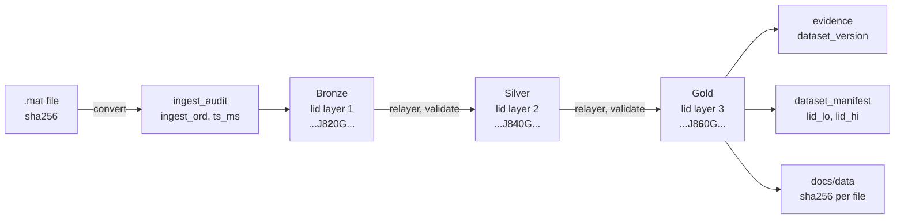
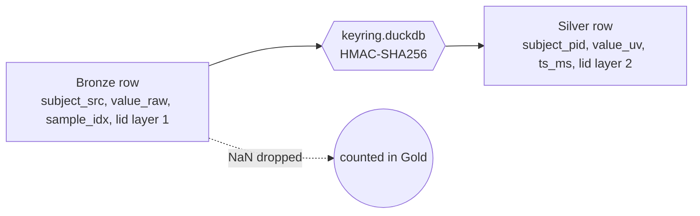

# Five records, end to end

Five records enter as samples in a `.mat` file and travel to Gold, evidence and the published copy. This page shows their key columns at every stage, so the lineage identifier can be watched changing while everything else stays put. Digests are cut to their first 12 characters for width; the full values sit in the tables they came from.

Every value is a query result from the real build in `DATA_DIR`, evidence run `01M3WTDATJYQ57CY5YHT2D54NR` of 2026-10-01. The folded SQL is the source as it stands today, and a test keeps it so.

Each transformation has its source SQL folded under the paragraph that introduces its result, click the line to open it. Closed, the page is data and flow only.

## 0. Who travels

| n | Experiment | subject_pid | Channel | Why this one |
|---|---|---|---|---|
| 1 | motor_basic | 536b14256e52d399 | 3 | the highest `line_noise_ratio` of the build |
| 2 | faces_basic | 536b14256e52d399 | 3 | same subject as 1, an experiment whose unit scale is assumed |
| 3 | fingerflex | 3b08103b5a44451c | 3 | the third experiment, another subject |
| 4 | motor_basic | 72d88db77f3716bb | 3 | a third subject, whose `faces_basic` files are the Fault A partition |
| 5 | fingerflex | 49c8f7217e7b2988 | 3 | the planted canary, with a NaN burst, must stop at Silver |

Subjects are named by pseudonym. The source subject code exists in Bronze and the keyring alone, so this page does not show it.

## 1. The map



One character of the identifier's text form moves as a record climbs: `2`, `4`, `6` at position 11. Everything else in the identifier is fixed at conversion time.

## 2. The file becomes an audit row

`convert_mat.py` hashes the file, writes the Bronze rows, then appends one audit row. The row never changes.

<details>
<summary>sql/bronze/ingest_audit.sql</summary>

```sql
-- bronze/ingest_audit, spec 3.1. One file per converted source file, never rewritten.
COPY (
    SELECT
        '{{ingest_id}}' AS ingest_id,
        '{{data_root}}' AS data_root,
        '{{source_path_rel}}' AS source_path_rel,
        '{{source_url}}' AS source_url,
        '{{sha256}}' AS sha256,
        {{bytes}}::BIGINT AS bytes,
        {{sample_rate_hz}}::INTEGER AS sample_rate_hz,
        {{rows_written}}::BIGINT AS rows_written,
        '{{tool}}' AS tool,
        '{{tool_version}}' AS tool_version,
        '{{duckdb_version}}' AS duckdb_version,
        '{{ingest_host}}' AS ingest_host,
        TIMESTAMP '{{ingested_at}}' AS ingested_at
) TO '{{data_dir}}/bronze/ingest_audit/{{ingest_id}}.parquet' (FORMAT parquet);
```

</details>

The row's columns are listed in `doc/spec.md` section 3.1, where they are defined once. The five files appear below with the identifiers that matter here.

`lineage_dim` is a view over the audit. It numbers the files in ingestion order and gives each its first ingestion time in milliseconds; both go into every identifier of that file.

<details>
<summary>sql/lineage/lid_extras.sql, lineage_dim</summary>

```sql
CREATE OR REPLACE VIEW lineage_dim AS
SELECT
    row_number() OVER (ORDER BY a.ingested_at, a.sha256)::SMALLINT AS ingest_ord,
    a.ingest_id,
    -- The audit stores the lakehouse root and the path below it, never the two joined.
    CASE WHEN starts_with(a.source_path_rel, '/') THEN a.source_path_rel
         ELSE a.data_root || '/' || a.source_path_rel END AS source_path,
    a.source_url,
    a.sha256,
    epoch_ms(a.ingested_at) AS ts_ms,
    r.experiment
FROM bronze_ingest_audit a
LEFT JOIN (SELECT DISTINCT experiment, ingest_id FROM bronze_recording) r USING (ingest_id);
```

</details>

| ingest_ord | ingest_id | sha256 | ts_ms | experiment |
|---|---|---|---|---|
| 5 | 01M3AS9Y5H012SDJPJH34P56DE | 7d7d347e2b29 | 1790289705138 | faces_basic |
| 15 | 01M3ASAJ0RHND369W7RDPXVJ2W | b8222d13c15c | 1790289725466 | fingerflex |
| 28 | 01M3ASBQJ6VY4SV1ESGDWGVHG3 | 0b1ba5cab220 | 1790289763912 | motor_basic |
| 39 | 01M3ASCJ857F5K5AG0C36NRVJE | 2dd289af9f4e | 1790289791240 | motor_basic |
| 44 | 01M3ASCWXE7R7HPMFXK8BS41BG | ea8e2ad5745c | 1790289802163 | fingerflex |

The build holds 45 files. The other 40 hold subjects this page does not follow.

## 3. The identifier is minted

One identifier per record, that is per file, run and channel. 128 bits, most significant first:

```
 ts_ms 48 | layer 4 | experiment 8 | reserved 4 || file 16 | run 4 | channel 10 | segment 10 | radioactive 1 | reserved 23
 hi word                                          lo word
```

Decoded, the five Bronze identifiers say exactly where each record sits. All five are layer 1, run 1 and segment 0, so those fields are left out. The canary's radioactive field is 1.

| n | lid | experiment | file | channel | radioactive |
|---|---|---|---|---|---|
| 1 | 01M3ASBQJ820G0070G1G000000 | 2 | 28 | 3 | 0 |
| 2 | 01M3AS9Y5J20R0018G1G000000 | 3 | 5 | 3 | 0 |
| 3 | 01M3ASAJ0T208003RG1G000000 | 1 | 15 | 3 | 0 |
| 4 | 01M3ASCJ8820G009RG1G000000 | 2 | 39 | 3 | 0 |
| 5 | 01M3ASCWXK20800B0G1G080000 | 1 | 44 | 3 | 1 |

Experiment codes: 1 fingerflex, 2 motor_basic, 3 faces_basic. The file number is `ingest_ord` from the table above.

<details>
<summary>sql/bronze/recording.sql, the mint, one lid per record</summary>

```sql
    JOIN (
        SELECT
            channel_idx,
            lid_to_uuid(lid_encode(epoch_ms(TIMESTAMP '{{ingested_at}}'), 1, {{experiment_code}},
                                {{ingest_ord}}, {{run}}, channel_idx, 0, {{radioactive}})) AS lid
        FROM (SELECT DISTINCT channel_idx FROM src_recording)
    ) l USING (channel_idx)
```

</details>

## 4. Bronze, raw and complete

Samples, one row each, in the file's own units, with the layer 1 identifier of their record. Bronze also holds the source subject code, left out here. Two samples per record: the first, and one at second 30, inside the burst of the canary file.

<details>
<summary>sql/bronze/recording.sql</summary>

```sql
-- bronze/recording, spec 3.1. One row per sample, raw units. A source NaN
-- arrives as NULL: DuckDB reads NaN from the numpy array as NULL. The row is kept.
-- The lid is computed once per record (channel) and joined, not once per sample.
COPY (
    SELECT
        '{{experiment}}' AS experiment,
        '{{subject_src}}' AS subject_src,
        {{run}}::SMALLINT AS run,
        r.channel_idx::SMALLINT AS channel_idx,
        r.sample_idx::INTEGER AS sample_idx,
        r.value_raw::FLOAT AS value_raw,
        '{{ingest_id}}' AS ingest_id,
        l.lid
    FROM src_recording r
    JOIN (
        SELECT
            channel_idx,
            lid_to_uuid(lid_encode(epoch_ms(TIMESTAMP '{{ingested_at}}'), 1, {{experiment_code}},
                                {{ingest_ord}}, {{run}}, channel_idx, 0, {{radioactive}})) AS lid
        FROM (SELECT DISTINCT channel_idx FROM src_recording)
    ) l USING (channel_idx)
) TO '{{data_dir}}/bronze/recording'
(FORMAT parquet, PARTITION_BY (experiment, subject_src, ingest_id), WRITE_PARTITION_COLUMNS, APPEND);
```

</details>

| n | sample_idx | value_raw | ingest_id | lid |
|---|---|---|---|---|
| 1 | 0 | -661.000 | 01M3ASBQJ6VY4SV1ESGDWGVHG3 | 01M3ASBQJ820G0070G1G000000 |
| 1 | 30250 | -1232.000 | 01M3ASBQJ6VY4SV1ESGDWGVHG3 | 01M3ASBQJ820G0070G1G000000 |
| 2 | 0 | -0.005 | 01M3AS9Y5H012SDJPJH34P56DE | 01M3AS9Y5J20R0018G1G000000 |
| 2 | 30250 | -1031.000 | 01M3AS9Y5H012SDJPJH34P56DE | 01M3AS9Y5J20R0018G1G000000 |
| 3 | 0 | -802.000 | 01M3ASAJ0RHND369W7RDPXVJ2W | 01M3ASAJ0T208003RG1G000000 |
| 3 | 30250 | -1074.000 | 01M3ASAJ0RHND369W7RDPXVJ2W | 01M3ASAJ0T208003RG1G000000 |
| 4 | 0 | -2853.000 | 01M3ASCJ857F5K5AG0C36NRVJE | 01M3ASCJ8820G009RG1G000000 |
| 4 | 30250 | 1317.000 | 01M3ASCJ857F5K5AG0C36NRVJE | 01M3ASCJ8820G009RG1G000000 |
| 5 | 0 | 123.349 | 01M3ASCWXE7R7HPMFXK8BS41BG | 01M3ASCWXK20800B0G1G080000 |
| 5 | 30250 | NULL | 01M3ASCWXE7R7HPMFXK8BS41BG | 01M3ASCWXK20800B0G1G080000 |

The burst arrives as NULL: the file holds NaN, and DuckDB reads NaN from the numpy array as NULL. Bronze keeps the row; the gap is counted later, not hidden.

Electrodes, one row per channel, same identifier as the samples of that record.

<details>
<summary>sql/bronze/electrode.sql</summary>

```sql
-- bronze/electrode, spec 3.1. One row per channel, NULL where the file has no location.
COPY (
    SELECT
        '{{experiment}}' AS experiment,
        '{{subject_src}}' AS subject_src,
        channel_idx::SMALLINT AS channel_idx,
        x_mm::FLOAT AS x_mm,
        y_mm::FLOAT AS y_mm,
        z_mm::FLOAT AS z_mm,
        brain_area::VARCHAR AS brain_area,
        '{{ingest_id}}' AS ingest_id,
        lid_to_uuid(lid_encode(epoch_ms(TIMESTAMP '{{ingested_at}}'), 1, {{experiment_code}},
                            {{ingest_ord}}, {{run}}, channel_idx, 0, {{radioactive}})) AS lid
    FROM src_electrode
) TO '{{data_dir}}/bronze/electrode'
(FORMAT parquet, PARTITION_BY (experiment, subject_src), WRITE_PARTITION_COLUMNS, APPEND);
```

</details>

| n | channel_idx | x_mm | brain_area | lid |
|---|---|---|---|---|
| 1 | 3 | -41.170 | NULL | 01M3ASBQJ820G0070G1G000000 |
| 2 | 3 | NULL | inferior temporal gyrus | 01M3AS9Y5J20R0018G1G000000 |
| 3 | 3 | -38.276 | frontal | 01M3ASAJ0T208003RG1G000000 |
| 4 | 3 | 64.918 | NULL | 01M3ASCJ8820G009RG1G000000 |
| 5 | 3 | 30.000 | temporal | 01M3ASCWXK20800B0G1G080000 |

Events belong to the run, not to a channel, so their identifier has channel 0. The first cue of each file:

<details>
<summary>sql/bronze/event.sql</summary>

```sql
-- bronze/event, spec 3.1. One row per cue onset. Events belong to the run, not to a channel,
-- so their lid carries channel 0.
COPY (
    SELECT
        '{{experiment}}' AS experiment,
        '{{subject_src}}' AS subject_src,
        {{run}}::SMALLINT AS run,
        e.sample_idx::INTEGER AS sample_idx,
        e.event_code::SMALLINT AS event_code,
        l.event_label::VARCHAR AS event_label,
        '{{ingest_id}}' AS ingest_id,
        lid_to_uuid(lid_encode(epoch_ms(TIMESTAMP '{{ingested_at}}'), 1, {{experiment_code}},
                            {{ingest_ord}}, {{run}}, 0, 0, {{radioactive}})) AS lid
    FROM src_event e
    LEFT JOIN src_label l USING (event_code)
) TO '{{data_dir}}/bronze/event'
(FORMAT parquet, PARTITION_BY (experiment, subject_src), WRITE_PARTITION_COLUMNS, APPEND);
```

</details>

| n | sample_idx | event_code | event_label | lid |
|---|---|---|---|---|
| 1 | 10120 | 11 | tongue | 01M3ASBQJ820G0070G00000000 |
| 2 | 5480 | 11 | house | 01M3AS9Y5J20R0018G00000000 |
| 3 | 7080 | 5 | little | 01M3ASAJ0T208003RG00000000 |
| 4 | 10120 | 12 | hand | 01M3ASCJ8820G009RG00000000 |
| 5 | 0 | 1 | thumb | 01M3ASCWXK20800B0G00080000 |

All five records are channel 3. Compare each event identifier with the sample identifier of its record: the channel characters differ, the rest is the same.

## 5. Silver, pseudonymised and typed



The keyring maps each source code to a pseudonym once, and only the keyring holds the pair. Silver sees the pseudonym.

<details>
<summary>pipeline/keyring.py, the pseudonym, then sql/silver/010_subject.sql</summary>

```sql
-- pipeline/keyring.py: subject_pid = hmac_sha256(secret, subject_src)[:16], one row per
-- new subject_src in keyring.key_map(subject_src, subject_pid, created_at).

-- silver/subject, spec 3.2. One row per pseudonym present in Bronze.
COPY (
    SELECT k.subject_pid, k.created_at AS first_seen_at
    FROM keyring.key_map k
    JOIN (SELECT DISTINCT subject_src FROM bronze_recording) b USING (subject_src)
    ORDER BY 1
) TO '{{data_dir}}/silver/subject/data_0.parquet' (FORMAT parquet);
```

</details>

| subject_pid | first_seen_at |
|---|---|
| 3b08103b5a44451c | 2026-09-21 19:51:54.688695 |
| 49c8f7217e7b2988 | 2026-09-21 19:51:54.688698 |
| 536b14256e52d399 | 2026-09-21 19:51:54.688702 |
| 72d88db77f3716bb | 2026-09-21 19:51:54.688725 |

One `silver/record` row per record, the lineage dimension. The loader validates that the incoming identifier is layer 1, then sets layer 2. `n_samples_src` counts the source samples, burst included. `scale_basis` reads `assumed` for record 2, the `faces_basic` file.

<details>
<summary>sql/silver/020_record.sql</summary>

```sql
-- silver/record, spec 12.2. One row per record (file, run, channel), the lineage dimension
-- of Silver. The lid is the Bronze lid with the layer set to 2, validated on the way.
-- n_samples_src counts source samples including NaN, so Gold derives missing_samples from
-- Silver alone. scale_basis says whether the experiment's microvolt scale is documented in
-- its own README or assumed from the other experiments.
COPY (
    SELECT
        lid_to_uuid(lid_relayer(lid_from_uuid(r.lid), 1)) AS lid,
        r.experiment,
        k.subject_pid,
        r.run,
        r.channel_idx,
        count(*)::BIGINT AS n_samples_src,
        u.scale_basis
    FROM bronze_recording r
    JOIN keyring.key_map k USING (subject_src)
    JOIN (VALUES {{unit_scale_values}}) u(experiment, uv_per_unit, scale_basis)
        ON u.experiment = r.experiment
    GROUP BY ALL
    ORDER BY 1
) TO '{{data_dir}}/silver/record/data_0.parquet' (FORMAT parquet);
```

</details>

| n | lid | subject_pid | n_samples_src | scale_basis |
|---|---|---|---|---|
| 1 | 01M3ASBQJ840G0070G1G000000 | 536b14256e52d399 | 390680 | documented |
| 2 | 01M3AS9Y5J40R0018G1G000000 | 536b14256e52d399 | 271400 | assumed |
| 3 | 01M3ASAJ0T408003RG1G000000 | 3b08103b5a44451c | 610040 | documented |
| 4 | 01M3ASCJ8840G009RG1G000000 | 72d88db77f3716bb | 390240 | documented |
| 5 | 01M3ASCWXK40800B0G1G080000 | 49c8f7217e7b2988 | 60000 | documented |

Decoded, only the layer moved. `lid_parent` returns the Bronze identifier with no lookup.

<details>
<summary>sql/lineage/lid_extras.sql, lid_parent</summary>

```sql
CREATE OR REPLACE MACRO lid_parent(lid) AS
    CASE WHEN lid_layer(lid_from_uuid(lid)) <= 1 THEN error('lid_parent: Bronze has no parent')
    ELSE lid_to_uuid(lid_from_uuid(lid) - (1::UHUGEINT << 76))
    END;
```

</details>

| n | lid | layer | radioactive | lid_parent |
|---|---|---|---|---|
| 1 | 01M3ASBQJ840G0070G1G000000 | 2 | 0 | 01M3ASBQJ820G0070G1G000000 |
| 2 | 01M3AS9Y5J40R0018G1G000000 | 2 | 0 | 01M3AS9Y5J20R0018G1G000000 |
| 3 | 01M3ASAJ0T408003RG1G000000 | 2 | 0 | 01M3ASAJ0T208003RG1G000000 |
| 4 | 01M3ASCJ8840G009RG1G000000 | 2 | 0 | 01M3ASCJ8820G009RG1G000000 |
| 5 | 01M3ASCWXK40800B0G1G080000 | 2 | 1 | 01M3ASCWXK20800B0G1G080000 |

The same two samples in `silver/recording`: microvolts, milliseconds, the record's identifier and the source sample index. The canary's burst sample is absent, not NULL. Silver dropped all 500 samples of the burst.

<details>
<summary>sql/silver/030_recording.sql</summary>

```sql
-- silver/recording, spec 3.2 and 12.2. Microvolts, milliseconds, pseudonyms. A sample
-- that is NULL in Bronze, a NaN in the source, is dropped.
-- Executed once per (experiment, subject_pid) partition by pipeline/run.py: DuckDB 1.5's
-- partitioned COPY does not keep the ORDER BY across its buffer flushes, a plain COPY does.
-- Sorted by lid, sample_idx inside the file. Row groups of at most 200,000 rows: DuckDB
-- rounds the size up to a multiple of 2048, so 198,656 is the largest value under the limit.
COPY (
    SELECT
        r.experiment,
        k.subject_pid,
        r.run,
        r.channel_idx,
        (r.sample_idx::BIGINT * 1000 / a.sample_rate_hz)::INTEGER AS ts_ms,
        (r.value_raw * u.uv_per_unit)::FLOAT AS value_uv,
        s.lid,
        r.sample_idx
    FROM bronze_recording r
    JOIN keyring.key_map k USING (subject_src)
    JOIN bronze_ingest_audit a USING (ingest_id)
    JOIN (SELECT lid, lid_parent(lid) AS bronze_lid FROM silver_record) s ON s.bronze_lid = r.lid
    JOIN (VALUES {{unit_scale_values}}) u(experiment, uv_per_unit, scale_basis) ON u.experiment = r.experiment
    WHERE r.experiment = '{{experiment}}' AND k.subject_pid = '{{subject_pid}}'
      AND r.value_raw IS NOT NULL AND NOT isnan(r.value_raw)
    ORDER BY s.lid, r.sample_idx
) TO '{{data_dir}}/silver/recording/experiment={{experiment}}/subject_pid={{subject_pid}}/data_0.parquet'
(FORMAT parquet, ROW_GROUP_SIZE 198656);
```

</details>

| n | asked | ts_ms | value_uv | sample_idx | lid |
|---|---|---|---|---|---|
| 1 | 0 | 0 | -19.698 | 0 | 01M3ASBQJ840G0070G1G000000 |
| 1 | 30250 | 30250 | -36.714 | 30250 | 01M3ASBQJ840G0070G1G000000 |
| 2 | 0 | 0 | -1.40e-04 | 0 | 01M3AS9Y5J40R0018G1G000000 |
| 2 | 30250 | 30250 | -30.724 | 30250 | 01M3AS9Y5J40R0018G1G000000 |
| 3 | 0 | 0 | -23.900 | 0 | 01M3ASAJ0T408003RG1G000000 |
| 3 | 30250 | 30250 | -32.005 | 30250 | 01M3ASAJ0T408003RG1G000000 |
| 4 | 0 | 0 | -85.019 | 0 | 01M3ASCJ8840G009RG1G000000 |
| 4 | 30250 | 30250 | 39.247 | 30250 | 01M3ASCJ8840G009RG1G000000 |
| 5 | 0 | 0 | 3.676 | 0 | 01M3ASCWXK40800B0G1G080000 |
| 5 | 30250 | absent | | | |

Electrodes and events mirror Bronze with the pseudonym, milliseconds instead of sample index, and no `ingest_id`; the file is inside the identifier now.

<details>
<summary>sql/silver/040_electrode.sql and 050_event.sql</summary>

```sql
-- silver/electrode, spec 3.2: Bronze with subject_src replaced by subject_pid, ingest_id removed.
COPY (
    SELECT
        b.experiment,
        k.subject_pid,
        b.channel_idx,
        b.x_mm,
        b.y_mm,
        b.z_mm,
        b.brain_area,
        lid_to_uuid(lid_relayer(lid_from_uuid(b.lid), 1)) AS lid
    FROM bronze_electrode b
    JOIN keyring.key_map k USING (subject_src)
    ORDER BY lid
) TO '{{data_dir}}/silver/electrode'
(FORMAT parquet, PARTITION_BY (experiment, subject_pid), WRITE_PARTITION_COLUMNS, OVERWRITE);

-- silver/event, spec 3.2: Bronze with subject_pid for subject_src, ts_ms for sample_idx,
-- ingest_id removed.
COPY (
    SELECT
        b.experiment,
        k.subject_pid,
        b.run,
        (b.sample_idx::BIGINT * 1000 / a.sample_rate_hz)::INTEGER AS ts_ms,
        b.event_code,
        b.event_label,
        lid_to_uuid(lid_relayer(lid_from_uuid(b.lid), 1)) AS lid
    FROM bronze_event b
    JOIN keyring.key_map k USING (subject_src)
    JOIN bronze_ingest_audit a USING (ingest_id)
    ORDER BY lid, ts_ms
) TO '{{data_dir}}/silver/event'
(FORMAT parquet, PARTITION_BY (experiment, subject_pid), WRITE_PARTITION_COLUMNS, OVERWRITE);
```

</details>

| n | subject_pid | channel_idx | brain_area | lid |
|---|---|---|---|---|
| 1 | 536b14256e52d399 | 3 | NULL | 01M3ASBQJ840G0070G1G000000 |
| 2 | 536b14256e52d399 | 3 | inferior temporal gyrus | 01M3AS9Y5J40R0018G1G000000 |
| 3 | 3b08103b5a44451c | 3 | frontal | 01M3ASAJ0T408003RG1G000000 |
| 4 | 72d88db77f3716bb | 3 | NULL | 01M3ASCJ8840G009RG1G000000 |
| 5 | 49c8f7217e7b2988 | 3 | temporal | 01M3ASCWXK40800B0G1G080000 |

| n | ts_ms | event_code | event_label | lid |
|---|---|---|---|---|
| 1 | 10120 | 11 | tongue | 01M3ASBQJ840G0070G00000000 |
| 2 | 5480 | 11 | house | 01M3AS9Y5J40R0018G00000000 |
| 3 | 7080 | 5 | little | 01M3ASAJ0T408003RG00000000 |
| 4 | 10120 | 12 | hand | 01M3ASCJ8840G009RG00000000 |
| 5 | 0 | 1 | thumb | 01M3ASCWXK40800B0G00080000 |

## 6. Gold, every value a query result

The marts read Silver and refuse any record whose identifier carries the radioactive bit. Record 5 stops here. The others get layer 3.

`gold/channel_quality`, one row per record. `missing_samples` is `n_samples_src` minus what Silver holds. It is 0 for every Gold record of this build: the one gap, the canary's burst, never reaches Gold. `line_noise_ratio` is the share of power at 50 and 60 Hz in the first 10 s. Record 1 reads 0.962, the highest of the build, against a median of 0.003.

<details>
<summary>sql/gold/010_channel_quality.sql, and the line noise excerpt from pipeline/line_noise.py</summary>

```sql
-- gold/channel_quality, spec 3.3. One row per record. Silver carries no amplifier range, so
-- the rails for clipped_pct are the observed extremes of value_uv within the run, the hardware
-- reading; clipped_own_pct measures each record against its own extremes, the signal reading.
-- missing_samples is the record's source sample count minus the samples present in Silver.
-- Canary records (radioactive bit, spec 12.5) never enter a Gold mart.
-- The rails come from the first pass, not from a second aggregate over every sample row.
-- An aggregate computed in the same statement carries no row count: grouping all 871 million
-- rows by experiment, subject_pid and run returns 45 rows, the planner estimates 907 million,
-- and the join to the scan is planned against that. See docs/lessons-learned.md.
COPY (
    WITH kept AS (
        SELECT lid, experiment, subject_pid, run, channel_idx, n_samples_src, scale_basis
        FROM silver_record
        WHERE lid_radioactive(lid_from_uuid(lid)) = 0
    ),
    extremes AS (
        SELECT lid, min(value_uv) AS lo, max(value_uv) AS hi
        FROM silver_recording
        WHERE lid IN (SELECT lid FROM kept)
        GROUP BY lid
    ),
    rails AS (
        SELECT k.experiment, k.subject_pid, k.run, min(e.lo) AS lo, max(e.hi) AS hi
        FROM extremes e
        JOIN kept k USING (lid)
        GROUP BY ALL
    ),
    rails_by_lid AS (
        SELECT k.lid, r.lo, r.hi
        FROM kept k
        JOIN rails r USING (experiment, subject_pid, run)
    ),
    q AS (
        SELECT
            r.lid,
            count(*)::BIGINT AS n_samples,
            sqrt(avg(r.value_uv * r.value_uv))::FLOAT AS rms_uv,
            (100.0 * count(*) FILTER (WHERE r.value_uv = b.lo OR r.value_uv = b.hi)
                / count(*))::FLOAT AS clipped_pct,
            (100.0 * count(*) FILTER (WHERE r.value_uv = e.lo OR r.value_uv = e.hi)
                / count(*))::FLOAT AS clipped_own_pct
        FROM silver_recording r
        JOIN rails_by_lid b USING (lid)
        JOIN extremes e USING (lid)
        GROUP BY r.lid
    )
    SELECT
        k.experiment,
        k.subject_pid,
        k.run,
        k.channel_idx,
        q.n_samples,
        (k.n_samples_src - q.n_samples)::BIGINT AS missing_samples,
        q.rms_uv,
        q.clipped_pct,
        q.clipped_own_pct,
        n.line_noise_ratio::FLOAT AS line_noise_ratio,
        k.scale_basis,
        lid_to_uuid(lid_relayer(lid_from_uuid(q.lid), 2)) AS lid
    FROM q
    JOIN kept k USING (lid)
    LEFT JOIN line_noise n USING (lid)
    ORDER BY 1, 2, 3, 4
) TO '{{data_dir}}/gold/channel_quality/data_0.parquet' (FORMAT parquet);

-- pipeline/line_noise.py fills the line_noise temp table: this query takes the first
-- 10 s of each record, Python runs rfft on it and keeps the 49 to 51 and 59 to 61 Hz share.
WITH rate AS (
    SELECT s.lid, a.sample_rate_hz
    FROM silver_record s
    JOIN lineage_dim d ON d.ingest_ord = lid_file(lid_from_uuid(s.lid))
    JOIN bronze_ingest_audit a USING (ingest_id)
)
SELECT r.lid, rate.sample_rate_hz, list(r.value_uv ORDER BY r.sample_idx) AS excerpt
FROM silver_recording r
JOIN rate USING (lid)
WHERE r.sample_idx < 10 * rate.sample_rate_hz
GROUP BY 1, 2
```

</details>

| n | n_samples | missing_samples | rms_uv | line_noise_ratio | lid |
|---|---|---|---|---|---|
| 1 | 390680 | 0 | 33.930 | 0.962 | 01M3ASBQJ860G0070G1G000000 |
| 2 | 271400 | 0 | 53.156 | 0.004 | 01M3AS9Y5J60R0018G1G000000 |
| 3 | 610040 | 0 | 55.685 | 0.026 | 01M3ASAJ0T608003RG1G000000 |
| 4 | 390240 | 0 | 87.401 | 0.043 | 01M3ASCJ8860G009RG1G000000 |
| 5 | absent, canary | | | | |

`gold/feature_window`, one row per record and second. The window that holds sample 30250 starts at 30000 ms and covers samples 30000 to 30999. `sample_lo` and `sample_hi` name that range in the record, so a gap would show as a later `sample_lo`.

<details>
<summary>sql/gold/030_feature_window.sql</summary>

```sql
-- gold/feature_window, spec 3.3 and 12.2. One row per record and 1,000 ms window, with the
-- window's source sample range inside the record. Canary records (spec 12.5) are left out.
-- The pass over silver/recording groups by lid and window only; the partition strings come
-- from silver/record afterwards, one row per record (see 010_channel_quality.sql).
COPY (
    WITH kept AS (
        SELECT lid, experiment, subject_pid, run, channel_idx
        FROM silver_record
        WHERE lid_radioactive(lid_from_uuid(lid)) = 0
    ),
    windows AS (
        SELECT
            lid,
            (ts_ms // 1000 * 1000)::INTEGER AS window_start_ms,
            avg(value_uv)::FLOAT AS mean_uv,
            stddev_pop(value_uv)::FLOAT AS std_uv,
            (max(value_uv) - min(value_uv))::FLOAT AS p2p_uv,
            min(sample_idx)::INTEGER AS sample_lo,
            max(sample_idx)::INTEGER AS sample_hi
        FROM silver_recording
        WHERE lid IN (SELECT lid FROM kept)
        GROUP BY lid, window_start_ms
    )
    SELECT
        k.experiment,
        k.subject_pid,
        k.run,
        k.channel_idx,
        w.window_start_ms,
        w.mean_uv,
        w.std_uv,
        w.p2p_uv,
        lid_to_uuid(lid_relayer(lid_from_uuid(w.lid), 2)) AS lid,
        w.sample_lo,
        w.sample_hi
    FROM windows w
    JOIN kept k USING (lid)
    ORDER BY lid, w.window_start_ms
) TO '{{data_dir}}/gold/feature_window/data_0.parquet' (FORMAT parquet);
```

</details>

| n | window_start_ms | mean_uv | sample_lo | sample_hi | lid |
|---|---|---|---|---|---|
| 1 | 30000 | -7.127 | 30000 | 30999 | 01M3ASBQJ860G0070G1G000000 |
| 2 | 30000 | -2.828 | 30000 | 30999 | 01M3AS9Y5J60R0018G1G000000 |
| 3 | 30000 | -0.510 | 30000 | 30999 | 01M3ASAJ0T608003RG1G000000 |
| 4 | 30000 | 67.479 | 30000 | 30999 | 01M3ASCJ8860G009RG1G000000 |
| 5 | absent, canary | | | | |

`gold/experiment_summary`, one row per experiment and subject. It spans records, so it carries no identifier; the canary subject is left out by its pseudonym.

<details>
<summary>sql/gold/020_experiment_summary.sql</summary>

```sql
-- gold/experiment_summary, spec 3.3. One row per experiment and subject. duration_s is the
-- sum over runs of the last present sample time plus one millisecond. A subject whose
-- records carry the radioactive bit (spec 12.5) is left out.
COPY (
    WITH canary AS (
        SELECT DISTINCT subject_pid FROM silver_record WHERE lid_radioactive(lid_from_uuid(lid)) = 1
    ),
    runs AS (
        SELECT experiment, subject_pid, run,
               count(DISTINCT channel_idx) AS n_channels,
               max(ts_ms) + 1 AS duration_ms
        FROM silver_recording
        WHERE subject_pid NOT IN (SELECT subject_pid FROM canary)
        GROUP BY ALL
    ),
    events AS (
        SELECT experiment, subject_pid, count(*) AS n_events
        FROM silver_event
        GROUP BY ALL
    )
    SELECT
        r.experiment,
        r.subject_pid,
        count(*)::SMALLINT AS n_runs,
        max(r.n_channels)::SMALLINT AS n_channels,
        (sum(r.duration_ms) / 1000.0)::FLOAT AS duration_s,
        coalesce(any_value(e.n_events), 0)::INTEGER AS n_events
    FROM runs r
    LEFT JOIN events e USING (experiment, subject_pid)
    GROUP BY 1, 2
    ORDER BY 1, 2
) TO '{{data_dir}}/gold/experiment_summary/data_0.parquet' (FORMAT parquet);
```

</details>

| n | experiment | subject_pid | n_channels | duration_s | n_events |
|---|---|---|---|---|---|
| 1 | motor_basic | 536b14256e52d399 | 62 | 390.680 | 60 |
| 2 | faces_basic | 536b14256e52d399 | 52 | 271.400 | 300 |
| 3 | fingerflex | 3b08103b5a44451c | 46 | 610.040 | 150 |
| 4 | motor_basic | 72d88db77f3716bb | 49 | 390.240 | 60 |
| 5 | absent, canary | | | | |

## 7. Back to the file, forward to the records

`lid_trace` on the Gold identifier of record 1 decodes the bits and joins `lineage_dim` once. The `rms_uv` of 33.930 above came from this file, this digest, this run and channel. `lid_trace` also returns the file's path, left out here because the file name carries the source subject code.

<details>
<summary>sql/lineage/lid_extras.sql, lid_trace</summary>

```sql
CREATE OR REPLACE MACRO lid_trace(lid) AS TABLE
    SELECT d.source_path, d.source_url, d.sha256, f.ts_ms, f.layer, e.experiment,
           f.run, f.channel, f.segment
    FROM (SELECT lid_decode(lid_from_uuid(lid)) AS f)
    JOIN lineage_dim d ON d.ingest_ord = f.file
    JOIN lineage_experiment e ON e.code = f.experiment;
```

</details>

| source_url | sha256 | layer | experiment | run | channel |
|---|---|---|---|---|---|
| https://stacks.stanford.edu/file/druid:zk881ps0522/motor_basic.zip | 0b1ba5cab220 | 3 | motor_basic | 1 | 3 |

`lid_children(28)` is a range scan between two identifiers. It returns every Silver record of file 28, the file of record 1.

<details>
<summary>sql/lineage/lid_extras.sql, lid_prefix_lo, lid_prefix_hi, lid_children</summary>

```sql
CREATE OR REPLACE MACRO lid_prefix_lo(ing) AS (
    SELECT lid_to_uuid(lid_encode(d.ts_ms, 2, e.code, ing, 0, 0, 0, 0))
    FROM lineage_dim d JOIN lineage_experiment e USING (experiment)
    WHERE d.ingest_ord = ing);

CREATE OR REPLACE MACRO lid_prefix_hi(ing) AS (
    SELECT lid_to_uuid(lid_encode(d.ts_ms, 2, e.code, ing, 15, 1023, 1023, 1) | ((1::UHUGEINT << 23) - 1))
    FROM lineage_dim d JOIN lineage_experiment e USING (experiment)
    WHERE d.ingest_ord = ing);

CREATE OR REPLACE MACRO lid_children(ing) AS TABLE
    SELECT * FROM silver_record
    WHERE lid BETWEEN lid_prefix_lo(ing) AND lid_prefix_hi(ing);
```

</details>

| records | first | last |
|---|---|---|
| 62 | 01M3ASBQJ840G0070G00000000 | 01M3ASBQJ840G0070GYG000000 |

## 8. Evidence, manifest, publication

Checks run over the datasets, not over single records, so their `lid` is NULL. Three rows of run `01M3WTDATJYQ57CY5YHT2D54NR`: the identifier rule for Silver, the file layout rule, the canary rule for Gold.

<details>
<summary>sql/checks/no_direct_identifier.sql, sql.sql, partition_layout.sql, the three templates behind these rows</summary>

```sql
-- no_direct_identifier: forbidden columns present in the dataset. Expected 0.
SELECT count(*) AS observed
FROM information_schema.columns
WHERE table_name = '{{view}}' AND column_name IN ({{forbidden_columns}})

-- sql: rows returned by the requirement's own query. Expected 0.
SELECT count(*) AS observed FROM ({{query}})

-- partition_layout: files with a row group over the maximum or fewer row groups than the
-- minimum. Expected 0.
SELECT count(*) AS observed
FROM (
    SELECT file_name,
           count(DISTINCT row_group_id) AS row_groups,
           max(row_group_num_rows) AS max_rows
    FROM parquet_metadata('{{data_dir}}/{{dataset}}/**/*.parquet')
    GROUP BY 1
)
WHERE row_groups < {{min_row_groups}} OR max_rows > {{max_rows_per_row_group}}
```

</details>

| requirement_id | dataset | dataset_version | result | observed | lid |
|---|---|---|---|---|---|
| GDPR-Art9 | silver/recording | 7c0dd6cd0c52 | pass | 0 | NULL |
| ISO13485-4.2.5 | silver/recording | 7c0dd6cd0c52 | pass | 0 | NULL |
| GDPR-Art9 | gold/channel_quality | 5f654194fba3 | pass | 0 | NULL |

`gold/dataset_manifest` names the build: the same `dataset_version` the evidence carries, the identifier range of the records, the number of source files behind them.

<details>
<summary>pipeline/manifest.py, the two queries per dataset, and pipeline/db.py dataset_version</summary>

```sql
-- per dataset view with a lid column
SELECT count(*), min(lid), max(lid) FROM {view};

SELECT DISTINCT d.sha256
FROM (SELECT DISTINCT lid FROM {view} WHERE lid IS NOT NULL) v
JOIN lineage_dim d ON d.ingest_ord = lid_file(lid_from_uuid(v.lid))
ORDER BY 1;

-- dataset_version, pipeline/db.py: sha256 of the sorted sha256 of the dataset's Parquet files
-- digests = sorted(sha256(file) for file in dataset/**/*.parquet)
-- dataset_version = sha256('\n'.join(digests))
```

</details>

| dataset_version | dataset | lid_lo | lid_hi | n_records | files |
|---|---|---|---|---|---|
| 5f654194fba3 | gold/channel_quality | 01M3AS9Q5W60R0008G00000000 | 01M3ASCSFN60G00AGGQG000000 | 2241 | 42 |
| 7c0dd6cd0c52 | silver/recording | 01M3AS9Q5W40R0008G00000000 | 01M3ASCXQV40G00B8GZG080000 | 871159620 | 45 |

Silver has 45 files behind it, Gold 42: the three canary files never reach a mart. `docs/data/manifest.json` records the published copies with their own digests.

<details>
<summary>pipeline/publish.py, the refusal query per published file</summary>

```sql
SELECT count(*) FROM read_parquet('{path}')
WHERE lid IS NOT NULL AND lid_radioactive(lid_from_uuid(lid)) = 1
-- any row above zero refuses the whole publish
```

</details>

| path | bytes | sha256 |
|---|---|---|
| gold/channel_quality/data_0.parquet | 34972 | bad96cfe9e4f |
| gold/dataset_manifest/data_0.parquet | 8154 | 23a8a559c3a3 |

## 9. What the five showed

| n | Lesson |
|---|---|
| 1 | The strongest line noise of the build is one number in Gold, traced to its file and digest without a second lookup. |
| 2 | Same subject as 1, other experiment: a different file, a different identifier, the same pseudonym. Its `scale_basis` says the unit scale is assumed. |
| 3 | Another experiment changes the identifier's experiment field and nothing else in the method. |
| 4 | A clean record moves through with nothing lost and every value a query result. |
| 5 | A gap in the source is kept in Bronze as NULL and dropped in Silver. The radioactive bit set at conversion survives Silver and stops every Gold mart, without any column to lose. |
