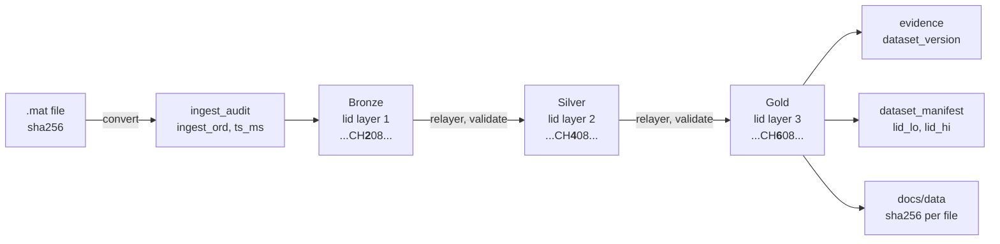
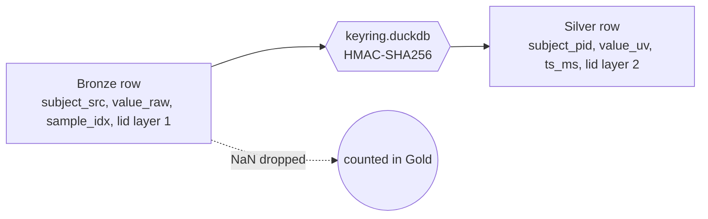

# Five records, end to end

Five records enter as samples in a `.mat` file and travel to Gold, evidence and the published copy. This page shows their complete tuples at every stage, so the lineage identifier can be watched changing while everything else stays put. Every value is a query result from one build of the synthetic data; digests, paths and commits are cut to their first characters for width, the full values sit in the tables they came from.

## 0. Who travels

| n | Experiment | Source subject | Channel | Why this one |
|---|---|---|---|---|
| 1 | fingerflex | aa | 0 | has the NaN burst and the injected 50 Hz tone |
| 2 | motor_basic | aa | 5 | clean channel, same subject as 1 |
| 3 | fingerflex | bb | 1 | has the NaN burst, another subject |
| 4 | motor_basic | cc | 3 | clean channel, third subject |
| 5 | fingerflex | canary | 3 | the planted canary, must stop at Silver |

The source subject code appears in this page only because the data is synthetic. In the real system it exists in Bronze and the keyring alone; a page like this one would be generated from Silver.

## 1. The map



One character of the identifier's text form moves as a record climbs: `2`, `4`, `6` at position 11. Everything else in the identifier is fixed at conversion time.

## 2. The file becomes an audit row

`convert_mat.py` hashes the file, writes the Bronze rows, then appends one audit row. The row never changes.

| ingest_id | source_path | source_url | sha256 | bytes | sample_rate_hz | rows_written | tool | tool_version | duckdb_version | ingested_at |
|---|---|---|---|---|---|---|---|---|---|---|
| 01M30739CGE2JX4EXKR65BTC6E | fingerflex/aa.mat | synthetic://fingerflex/aa.mat | 65c157a67f68 | 15485896 | 1000 | 3840000 | convert_mat.py | 868ab53 | 1.5.5 | 2026-09-20 20:11:08.561115 |
| 01M3073A6E8SR2B7JF97DG0H07 | fingerflex/bb.mat | synthetic://fingerflex/bb.mat | 51bdb94158ef | 15485896 | 1000 | 3840000 | convert_mat.py | 868ab53 | 1.5.5 | 2026-09-20 20:11:09.391338 |
| 01M3073AZA3B2PSZTSGH07Y31Y | fingerflex/canary.mat | synthetic://fingerflex/canary.mat | b8a002899aac | 15485904 | 1000 | 3840000 | convert_mat.py | 868ab53 | 1.5.5 | 2026-09-20 20:11:10.188543 |
| 01M3073CEHVGSATDYM49B26G2H | motor_basic/aa.mat | synthetic://motor_basic/aa.mat | d78878cdb442 | 15485896 | 1000 | 3840000 | convert_mat.py | 868ab53 | 1.5.5 | 2026-09-20 20:11:11.698465 |
| 01M3073EJFREB8YATMZYFR5981 | motor_basic/cc.mat | synthetic://motor_basic/cc.mat | c96c66f737e3 | 15485896 | 1000 | 3840000 | convert_mat.py | 868ab53 | 1.5.5 | 2026-09-20 20:11:13.872694 |

`lineage_dim` is a view over the audit. It numbers the files in ingestion order and gives each its first ingestion time in milliseconds; both go into every identifier of that file.

| ingest_ord | ingest_id | sha256 | ts_ms | experiment |
|---|---|---|---|---|
| 1 | 01M30739CGE2JX4EXKR65BTC6E | 65c157a67f68 | 1789935068561 | fingerflex |
| 2 | 01M3073A6E8SR2B7JF97DG0H07 | 51bdb94158ef | 1789935069391 | fingerflex |
| 3 | 01M3073AZA3B2PSZTSGH07Y31Y | b8a002899aac | 1789935070188 | fingerflex |
| 5 | 01M3073CEHVGSATDYM49B26G2H | d78878cdb442 | 1789935071698 | motor_basic |
| 8 | 01M3073EJFREB8YATMZYFR5981 | c96c66f737e3 | 1789935073872 | motor_basic |

Files 4, 6 and 7 exist; they hold subjects this page does not follow.

## 3. The identifier is minted

One identifier per record, that is per file, run and channel. 128 bits, most significant first:

```
 ts_ms 48 | layer 4 | experiment 8 | reserved 4 || file 16 | run 4 | channel 10 | segment 10 | radioactive 1 | reserved 23
 hi word                                          lo word
```

Decoded, the five Bronze identifiers say exactly where each record sits. The canary's last field is 1.

| n | lid | ts_ms | layer | experiment | file | run | channel | segment | radioactive |
|---|---|---|---|---|---|---|---|---|---|
| 1 | 01M30739CH2080008G00000000 | 1789935068561 | 1 | 1 | 1 | 1 | 0 | 0 | 0 |
| 2 | 01M3073CEJ20G0018G2G000000 | 1789935071698 | 1 | 2 | 5 | 1 | 5 | 0 | 0 |
| 3 | 01M3073A6F208000GG0G000000 | 1789935069391 | 1 | 1 | 2 | 1 | 1 | 0 | 0 |
| 4 | 01M3073EJG20G0020G1G000000 | 1789935073872 | 1 | 2 | 8 | 1 | 3 | 0 | 0 |
| 5 | 01M3073AZC208000RG1G080000 | 1789935070188 | 1 | 1 | 3 | 1 | 3 | 0 | 1 |

Experiment codes: 1 fingerflex, 2 motor_basic. The file number is `ingest_ord` from the table above.

## 4. Bronze, raw and complete

Samples, one row each, in the file's own units, with the source subject code and the layer 1 identifier of their record. Two samples per record: the first, and one inside the burst that three of the files carry at second 30.

| n | experiment | subject_src | run | channel_idx | sample_idx | value_raw | ingest_id | lid |
|---|---|---|---|---|---|---|---|---|
| 1 | fingerflex | aa | 1 | 0 | 0 | 61.942 | 01M30739CGE2JX4EXKR65BTC6E | 01M30739CH2080008G00000000 |
| 1 | fingerflex | aa | 1 | 0 | 30250 | NULL | 01M30739CGE2JX4EXKR65BTC6E | 01M30739CH2080008G00000000 |
| 2 | motor_basic | aa | 1 | 5 | 0 | 191.232 | 01M3073CEHVGSATDYM49B26G2H | 01M3073CEJ20G0018G2G000000 |
| 2 | motor_basic | aa | 1 | 5 | 30250 | 30.633 | 01M3073CEHVGSATDYM49B26G2H | 01M3073CEJ20G0018G2G000000 |
| 3 | fingerflex | bb | 1 | 1 | 0 | 129.158 | 01M3073A6E8SR2B7JF97DG0H07 | 01M3073A6F208000GG0G000000 |
| 3 | fingerflex | bb | 1 | 1 | 30250 | NULL | 01M3073A6E8SR2B7JF97DG0H07 | 01M3073A6F208000GG0G000000 |
| 4 | motor_basic | cc | 1 | 3 | 0 | -91.151 | 01M3073EJFREB8YATMZYFR5981 | 01M3073EJG20G0020G1G000000 |
| 4 | motor_basic | cc | 1 | 3 | 30250 | -32.514 | 01M3073EJFREB8YATMZYFR5981 | 01M3073EJG20G0020G1G000000 |
| 5 | fingerflex | canary | 1 | 3 | 0 | 123.349 | 01M3073AZA3B2PSZTSGH07Y31Y | 01M3073AZC208000RG1G080000 |
| 5 | fingerflex | canary | 1 | 3 | 30250 | NULL | 01M3073AZA3B2PSZTSGH07Y31Y | 01M3073AZC208000RG1G080000 |

The burst arrives as NULL: the file holds NaN, and DuckDB reads NaN from the numpy array as NULL. Bronze keeps the row; the gap is counted later, not hidden.

Electrodes, one row per channel, same identifier as the samples of that channel.

| n | experiment | subject_src | channel_idx | x_mm | y_mm | z_mm | brain_area | ingest_id | lid |
|---|---|---|---|---|---|---|---|---|---|
| 1 | fingerflex | aa | 0 | 0.000 | 0.000 | 40.000 | precentral | 01M30739CGE2JX4EXKR65BTC6E | 01M30739CH2080008G00000000 |
| 2 | motor_basic | aa | 5 | 50.000 | 0.000 | 40.000 | postcentral | 01M3073CEHVGSATDYM49B26G2H | 01M3073CEJ20G0018G2G000000 |
| 3 | fingerflex | bb | 1 | 10.000 | 0.000 | 40.000 | postcentral | 01M3073A6E8SR2B7JF97DG0H07 | 01M3073A6F208000GG0G000000 |
| 4 | motor_basic | cc | 3 | 30.000 | 0.000 | 40.000 | temporal | 01M3073EJFREB8YATMZYFR5981 | 01M3073EJG20G0020G1G000000 |
| 5 | fingerflex | canary | 3 | 30.000 | 0.000 | 40.000 | temporal | 01M3073AZA3B2PSZTSGH07Y31Y | 01M3073AZC208000RG1G080000 |

Events belong to the run, not to a channel, so their identifier has channel 0. The first cue of each file:

| n | experiment | subject_src | run | sample_idx | event_code | event_label | ingest_id | lid |
|---|---|---|---|---|---|---|---|---|
| 1 | fingerflex | aa | 1 | 0 | 1 | thumb | 01M30739CGE2JX4EXKR65BTC6E | 01M30739CH2080008G00000000 |
| 2 | motor_basic | aa | 1 | 0 | 1 | hand | 01M3073CEHVGSATDYM49B26G2H | 01M3073CEJ20G0018G00000000 |
| 3 | fingerflex | bb | 1 | 0 | 1 | thumb | 01M3073A6E8SR2B7JF97DG0H07 | 01M3073A6F208000GG00000000 |
| 4 | motor_basic | cc | 1 | 0 | 1 | hand | 01M3073EJFREB8YATMZYFR5981 | 01M3073EJG20G0020G00000000 |
| 5 | fingerflex | canary | 1 | 0 | 1 | thumb | 01M3073AZA3B2PSZTSGH07Y31Y | 01M3073AZC208000RG00080000 |

Record 1 is channel 0, so its event identifier and its sample identifier coincide. For records 2 to 5 compare the two: the channel characters differ, the rest is the same.

## 5. Silver, pseudonymised and typed



The keyring maps each source code to a pseudonym once, and only the keyring holds the pair. Silver sees the pseudonym.

| subject_pid | first_seen_at |
|---|---|
| 330a1a33c4ea905e | 2026-09-20 20:11:14.744459 |
| 4870aca0c2bc23d6 | 2026-09-20 20:11:14.744455 |
| 8697935b255ab403 | 2026-09-20 20:11:14.744435 |
| feff3135d21f3fc6 | 2026-09-20 20:11:14.744458 |

One `silver/record` row per record, the lineage dimension. The loader validates that the incoming identifier is layer 1, then sets layer 2. `n_samples_src` counts the source samples, burst included.

| n | lid | experiment | subject_pid | run | channel_idx | n_samples_src |
|---|---|---|---|---|---|---|
| 1 | 01M30739CH4080008G00000000 | fingerflex | 8697935b255ab403 | 1 | 0 | 60000 |
| 2 | 01M3073CEJ40G0018G2G000000 | motor_basic | 8697935b255ab403 | 1 | 5 | 60000 |
| 3 | 01M3073A6F408000GG0G000000 | fingerflex | 4870aca0c2bc23d6 | 1 | 1 | 60000 |
| 4 | 01M3073EJG40G0020G1G000000 | motor_basic | 330a1a33c4ea905e | 1 | 3 | 60000 |
| 5 | 01M3073AZC408000RG1G080000 | fingerflex | feff3135d21f3fc6 | 1 | 3 | 60000 |

Decoded, only the layer moved. `lid_parent` returns the Bronze identifier with no lookup.

| n | lid | layer | file | channel | radioactive | lid_parent |
|---|---|---|---|---|---|---|
| 1 | 01M30739CH4080008G00000000 | 2 | 1 | 0 | 0 | 01M30739CH2080008G00000000 |
| 2 | 01M3073CEJ40G0018G2G000000 | 2 | 5 | 5 | 0 | 01M3073CEJ20G0018G2G000000 |
| 3 | 01M3073A6F408000GG0G000000 | 2 | 2 | 1 | 0 | 01M3073A6F208000GG0G000000 |
| 4 | 01M3073EJG40G0020G1G000000 | 2 | 8 | 3 | 0 | 01M3073EJG20G0020G1G000000 |
| 5 | 01M3073AZC408000RG1G080000 | 2 | 3 | 3 | 1 | 01M3073AZC208000RG1G080000 |

The same two samples in `silver/recording`: microvolts (raw times 0.1), milliseconds, pseudonym, the record's identifier and the source sample index. The three burst samples are absent, not NULL.

| n | asked | experiment | subject_pid | run | channel_idx | ts_ms | value_uv | lid | sample_idx |
|---|---|---|---|---|---|---|---|---|---|
| 1 | 0 | fingerflex | 8697935b255ab403 | 1 | 0 | 0 | 6.194 | 01M30739CH4080008G00000000 | 0 |
| 1 | 30250 | absent | | | | | | | |
| 2 | 0 | motor_basic | 8697935b255ab403 | 1 | 5 | 0 | 19.123 | 01M3073CEJ40G0018G2G000000 | 0 |
| 2 | 30250 | motor_basic | 8697935b255ab403 | 1 | 5 | 30250 | 3.063 | 01M3073CEJ40G0018G2G000000 | 30250 |
| 3 | 0 | fingerflex | 4870aca0c2bc23d6 | 1 | 1 | 0 | 12.916 | 01M3073A6F408000GG0G000000 | 0 |
| 3 | 30250 | absent | | | | | | | |
| 4 | 0 | motor_basic | 330a1a33c4ea905e | 1 | 3 | 0 | -9.115 | 01M3073EJG40G0020G1G000000 | 0 |
| 4 | 30250 | motor_basic | 330a1a33c4ea905e | 1 | 3 | 30250 | -3.251 | 01M3073EJG40G0020G1G000000 | 30250 |
| 5 | 0 | fingerflex | feff3135d21f3fc6 | 1 | 3 | 0 | 12.335 | 01M3073AZC408000RG1G080000 | 0 |
| 5 | 30250 | absent | | | | | | | |

Electrodes and events mirror Bronze with the pseudonym, milliseconds instead of sample index, and no `ingest_id`; the file is inside the identifier now.

| n | experiment | subject_pid | channel_idx | x_mm | y_mm | z_mm | brain_area | lid |
|---|---|---|---|---|---|---|---|---|
| 1 | fingerflex | 8697935b255ab403 | 0 | 0.000 | 0.000 | 40.000 | precentral | 01M30739CH4080008G00000000 |
| 2 | motor_basic | 8697935b255ab403 | 5 | 50.000 | 0.000 | 40.000 | postcentral | 01M3073CEJ40G0018G2G000000 |
| 3 | fingerflex | 4870aca0c2bc23d6 | 1 | 10.000 | 0.000 | 40.000 | postcentral | 01M3073A6F408000GG0G000000 |
| 4 | motor_basic | 330a1a33c4ea905e | 3 | 30.000 | 0.000 | 40.000 | temporal | 01M3073EJG40G0020G1G000000 |
| 5 | fingerflex | feff3135d21f3fc6 | 3 | 30.000 | 0.000 | 40.000 | temporal | 01M3073AZC408000RG1G080000 |

| n | experiment | subject_pid | run | ts_ms | event_code | event_label | lid |
|---|---|---|---|---|---|---|---|
| 1 | fingerflex | 8697935b255ab403 | 1 | 0 | 1 | thumb | 01M30739CH4080008G00000000 |
| 2 | motor_basic | 8697935b255ab403 | 1 | 0 | 1 | hand | 01M3073CEJ40G0018G00000000 |
| 3 | fingerflex | 4870aca0c2bc23d6 | 1 | 0 | 1 | thumb | 01M3073A6F408000GG00000000 |
| 4 | motor_basic | 330a1a33c4ea905e | 1 | 0 | 1 | hand | 01M3073EJG40G0020G00000000 |
| 5 | fingerflex | feff3135d21f3fc6 | 1 | 0 | 1 | thumb | 01M3073AZC408000RG00080000 |

## 6. Gold, every value a query result

The marts read Silver and refuse any record whose identifier carries the canary bit. Record 5 stops here. The others get layer 3.

`gold/channel_quality`, one row per record. `missing_samples` is `n_samples_src` minus what Silver holds: the 500 sample burst shows up as 500. `line_noise_ratio` is the share of power at 50 and 60 Hz in the first 10 s; record 1 carries the injected tone, so it stands out at 0.030 against 0.002.

| n | experiment | subject_pid | run | channel_idx | n_samples | missing_samples | rms_uv | clipped_pct | line_noise_ratio | lid |
|---|---|---|---|---|---|---|---|---|---|---|
| 1 | fingerflex | 8697935b255ab403 | 1 | 0 | 59500 | 500 | 41.246 | 0.000 | 0.030 | 01M30739CH6080008G00000000 |
| 2 | motor_basic | 8697935b255ab403 | 1 | 5 | 60000 | 0 | 40.518 | 0.000 | 0.002 | 01M3073CEJ60G0018G2G000000 |
| 3 | fingerflex | 4870aca0c2bc23d6 | 1 | 1 | 59500 | 500 | 40.578 | 0.000 | 0.002 | 01M3073A6F608000GG0G000000 |
| 4 | motor_basic | 330a1a33c4ea905e | 1 | 3 | 60000 | 0 | 40.567 | 0.000 | 0.002 | 01M3073EJG60G0020G1G000000 |
| 5 | absent, canary | | | | | | | | | |

`gold/feature_window`, one row per record and second. The window that holds sample 30250: for the burst records the window starts at sample 30500, because samples 30000 to 30499 are gone, and `sample_lo` says so.

| n | experiment | subject_pid | run | channel_idx | window_start_ms | mean_uv | std_uv | p2p_uv | lid | sample_lo | sample_hi |
|---|---|---|---|---|---|---|---|---|---|---|---|
| 1 | fingerflex | 8697935b255ab403 | 1 | 0 | 30000 | 0.522 | 41.131 | 203.212 | 01M30739CH6080008G00000000 | 30500 | 30999 |
| 2 | motor_basic | 8697935b255ab403 | 1 | 5 | 30000 | -0.047 | 40.280 | 197.758 | 01M3073CEJ60G0018G2G000000 | 30000 | 30999 |
| 3 | fingerflex | 4870aca0c2bc23d6 | 1 | 1 | 30000 | 0.383 | 41.294 | 193.428 | 01M3073A6F608000GG0G000000 | 30500 | 30999 |
| 4 | motor_basic | 330a1a33c4ea905e | 1 | 3 | 30000 | -0.363 | 40.012 | 205.377 | 01M3073EJG60G0020G1G000000 | 30000 | 30999 |
| 5 | absent, canary | | | | | | | | | | |

`gold/experiment_summary`, one row per experiment and subject. It spans records, so it carries no identifier; the canary subject is left out by its pseudonym.

| n | experiment | subject_pid | n_runs | n_channels | duration_s | n_events |
|---|---|---|---|---|---|---|
| 1 | fingerflex | 8697935b255ab403 | 1 | 64 | 60.000 | 30 |
| 2 | motor_basic | 8697935b255ab403 | 1 | 64 | 60.000 | 30 |
| 3 | fingerflex | 4870aca0c2bc23d6 | 1 | 64 | 60.000 | 30 |
| 4 | motor_basic | 330a1a33c4ea905e | 1 | 64 | 60.000 | 30 |
| 5 | absent, canary | | | | | |

## 7. Back to the file, forward to the records

`lid_trace` on the Gold identifier of record 1 decodes the bits and joins `lineage_dim` once. The number 41.246 above came from this file, this digest, this run and channel.

| source_path | source_url | sha256 | ts_ms | layer | experiment | run | channel | segment |
|---|---|---|---|---|---|---|---|---|
| fingerflex/aa.mat | synthetic://fingerflex/aa.mat | 65c157a67f68 | 1789935068561 | 3 | fingerflex | 1 | 0 | 0 |

`lid_children(1)` is a range scan between two identifiers; it returns every Silver record of file 1.

| records | first | last |
|---|---|---|
| 64 | 01M30739CH4080008G00000000 | 01M30739CH4080008GZG000000 |

## 8. Evidence, manifest, publication

Checks run over the datasets, not over single records, so their `lid` is NULL. Three rows of the last run: the identifier rule for Silver, the canary rule for Gold, the file layout rule.

| run_id | check_id | requirement_id | framework | dataset | dataset_version | check_kind | result | observed | expected | ran_at | engine_version | git_commit | lid |
|---|---|---|---|---|---|---|---|---|---|---|---|---|---|
| 01M3075NM9ZSF1P822HXTA9W34 | GDPR-Art9/no_direct_identifier/silver/recording/['subject_src'] | GDPR-Art9 | GDPR-Art9 | silver/recording | 04eacd2c0a53 | no_direct_identifier | pass | 0 | 0 | 2026-09-20 20:12:26.633977 | 1.5.5 | 868ab53 | NULL |
| 01M3075NM9ZSF1P822HXTA9W34 | GDPR-Art9/sql/gold/channel_quality/SELECT 1 FROM gold_channel_quality WHERE lid_radioactive(lid_from_uuid(lid)) = 1 | GDPR-Art9 | GDPR-Art9 | gold/channel_quality | 2612b79bcb85 | sql | pass | 0 | 0 | 2026-09-20 20:12:26.633977 | 1.5.5 | 868ab53 | NULL |
| 01M3075NM9ZSF1P822HXTA9W34 | ISO13485-4.2.5/partition_layout/silver/recording/200000/2 | ISO13485-4.2.5 | ISO13485 | silver/recording | 04eacd2c0a53 | partition_layout | pass | 0 | 0 | 2026-09-20 20:12:26.633977 | 1.5.5 | 868ab53 | NULL |

`gold/dataset_manifest` names the build: the same `dataset_version` the evidence carries, the identifier range of the records, the number of source files behind them.

| dataset_version | dataset | layer | lid_lo | lid_hi | n_records | files | produced_at | git_commit |
|---|---|---|---|---|---|---|---|---|
| 2612b79bcb85 | gold/channel_quality | 3 | 01M30739CH6080008G00000000 | 01M3073EJG60G0020GZG000000 | 384 | 6 | 2026-09-20 20:12:24.243828 | 868ab53 |
| 04eacd2c0a53 | silver/recording | 2 | 01M30739CH4080008G00000000 | 01M3073EJG40G0020GZG000000 | 30718000 | 8 | 2026-09-20 20:12:24.243828 | 868ab53 |

Silver has 8 files behind it, Gold 6: the two canary files never reach a mart. `docs/data/manifest.json` records the published copies with their own digests.

| path | bytes | sha256 |
|---|---|---|
| gold/channel_quality/data_0.parquet | 7360 | 9605d0fa03d0 |
| gold/dataset_manifest/data_0.parquet | 4309 | 1b3c443a0443 |

## 9. What the five showed

| n | Lesson |
|---|---|
| 1 | A gap in the source is kept in Bronze, dropped in Silver, counted in Gold, and visible in the window range. The injected tone is measurable. |
| 2 | Same subject as 1, other experiment: a different file, a different identifier, the same pseudonym. |
| 3 | The burst lands on a different channel per subject; the identifier's channel field and `sample_lo` tell which. |
| 4 | A clean record moves through with nothing lost and every value a query result. |
| 5 | The canary bit set at conversion survives Silver and stops every Gold mart, without any column to lose. |
