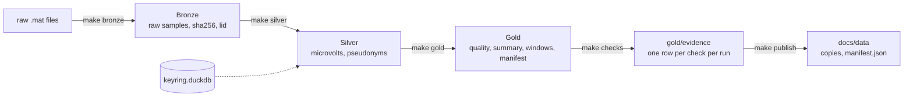
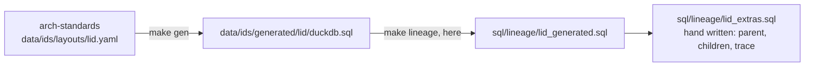

# Operating manual

How to run, check, inspect and reset the build. Every command here was run before it was written.

## 0. The map



`make all` runs the whole row, left to right.

## 1. Set up, once

```bash
python -m venv .venv && source .venv/bin/activate
pip install -e ".[dev]"
```

Needs Python 3.12 or later and `make`, on Linux, macOS or WSL.

| Where | What lives there |
|---|---|
| `DATA_DIR`, default `$HOME/data/ecog-lakehouse` | `raw/`, `bronze/`, `silver/`, `gold/`, `quarantine/`, `keyring.duckdb` |
| `docs/data/` in the repository | The published copy of Gold, the fault files, `manifest.json`. Tracked by git |

Data never goes anywhere else inside the repository.

`quarantine/<ingest_id>/` holds Bronze files of an ingest that failed before its audit row. `make bronze` moves them there when it starts and prints one `convert: quarantined ...` line per ingest. Nothing reads them and nothing deletes them.

## 2. Build

| Data | Command | Time |
|---|---|---|
| Generated, no download | `make all SYNTH=1` | under a minute |
| The real recordings, 2 GB | `make fetch && make all` | about 9 minutes after the download, on 12 threads |

The last lines to look for:

```
checks: run <id>, {'pass': N, 'fail': N, 'error': 0}, 0 blocking
publish: N files, N bytes, manifest at ...
```

Done when it says `0 blocking`. On the real data, 3 checks fail as flags: the recordings fall outside a plausibility range. A flag is recorded and does not stop the build.

Running it again is safe. Bronze skips every file it has already seen, by sha256. Silver and Gold are rebuilt. Evidence gets one more run appended.

`make publish` overwrites `docs/data/gold` with your build. To get the published copy back:

```bash
git checkout docs/data && git clean -fd docs/data
```

## 3. Check

```bash
make lint && make test
```

Done when the last line says `passed`. Lint runs ruff on the Python and checks every document for dashes and filler words. CI runs the same two commands, then `make all SYNTH=1`, on every pull request.

## 4. Look inside

Each snippet opens a connection with every dataset as a view and the `lid` macros loaded, then asks one question. Run them from the repository root.

### 4.1 Trace one Gold number back to its file

```bash
python3 - <<'EOF'
from pipeline import db
con = db.connect()
lid, rms = con.execute("SELECT lid, rms_uv FROM gold_channel_quality LIMIT 1").fetchone()
print("rms_uv", rms, "lid", con.execute("SELECT lid_text(lid_from_uuid(?))", [lid]).fetchone()[0])
print(con.sql("SELECT source_path, sha256, experiment, run, channel FROM lid_trace(?)", params=[lid]))
EOF
```

You get the source file, its sha256 and the run and channel the number came from. The decode needs no join; the file path comes from one lookup.

### 4.2 The evidence of the last run

```bash
python3 - <<'EOF'
from pipeline import db
print(db.connect().sql("""
SELECT framework, severity, result, count(*) AS checks
FROM gold_evidence
WHERE run_id = (SELECT max(run_id) FROM gold_evidence)
GROUP BY ALL ORDER BY 1, 2, 3"""))
EOF
```

`contract` is the checks derived from `contracts/*.yaml`. The other frameworks are the rows of `governance/requirements.csv`.

### 4.3 The canary

```bash
python3 - <<'EOF'
from pipeline import db
print(db.connect().sql("""
SELECT count(*) FILTER (WHERE lid_radioactive(lid_from_uuid(lid)) = 1) AS canary_in_silver,
       (SELECT count(*) FROM gold_channel_quality
        WHERE lid_radioactive(lid_from_uuid(lid)) = 1) AS canary_in_gold
FROM silver_record"""))
EOF
```

Expected: a positive number in Silver, 0 in Gold. The canary is a fake subject planted to prove nothing leaks. Its flag is the radioactive bit inside the identifier, so a copied row keeps it.

### 4.4 What this build is made of

```bash
python3 -c "from pipeline import db; print(db.connect().sql('SELECT dataset, n_records, dataset_version FROM gold_dataset_manifest ORDER BY 1'))"
```

One row per dataset. `dataset_version` is the digest the evidence rows carry, so one value names exactly this data.

## 5. One step at a time

| Command | Writes | Where |
|---|---|---|
| `make fetch` | the Stanford zips, verified by sha256 and unpacked | `DATA_DIR/raw/<experiment>/` |
| `make synth` | generated `.mat` files, kept if present | `DATA_DIR/raw/synthetic/` |
| `make bronze` | raw samples, electrodes, events, ingest audit | `DATA_DIR/bronze/` |
| `make silver` | the pseudonymised, typed layer, and the keyring | `DATA_DIR/silver/`, `keyring.duckdb` |
| `make gold` | quality, summary, windows, dataset manifest | `DATA_DIR/gold/` |
| `make checks` | one evidence file per run, never rewritten | `DATA_DIR/gold/evidence/run_id=<id>/` |
| `make publish` | copies of Gold, `manifest.json`, `checks.json`, `lid.sql` | `docs/data/` |
| `make bench` | row counts and the four fault measurements | `docs/bench.md` |
| `make sbom` | the bill of materials | `sbom.cdx.json` |

Each layer reads the one before it. `make bronze SYNTH=1` generates the synthetic files first.

`make bench` needs a DuckDB CLI and a Silver build; `faults/lib.sh` says where it looks. Set `BASE_URL` to measure against a real host:

```bash
BASE_URL=https://mrbisonte.github.io/ecog-lakehouse/data make bench
```

## 6. Change the identifier layout

The `lid` bit layout lives in a sibling repository, arch-standards. The macros are generated there and copied here.



```bash
make lineage ARCH_STANDARDS=../arch-standards && make test
```

Do not edit `lid_generated.sql`.

A layout change is a decision and needs an ADR. Every `lid` in `DATA_DIR` was built with the old layout, so reset (section 9) and rebuild.

## 7. Add a governance rule

1. Add one row to `governance/requirements.csv`, in the order of its header `framework,requirement_id,clause,control,check_kind,dataset,params,severity`. `params` is JSON.
2. `make checks`.
3. Read the evidence (section 4.2).

| Severity | A failing check |
|---|---|
| `block` | stops `make all` |
| `flag` | is recorded with the offending records, and the build goes on |

| Kind | Params | Passes when |
|---|---|---|
| `not_null` | `{"column": "c"}` | no NULL in `c` |
| `unique` | `{"columns": ["a", "b"]}` | no duplicate across the columns |
| `row_count_min` | `{"min": n}` | at least `n` rows |
| `no_direct_identifier` | `{"forbidden_columns": ["subject_src"]}` | none of the columns exist |
| `hash_match` | `{}` | every audit sha256 matches the file on disk |
| `partition_layout` | `{"max_rows_per_row_group": n, "min_row_groups": n}` | Parquet metadata within bounds |
| `retention` | `{"max_age_days": n}` | oldest file younger than `n` days |
| `sql` | `{"sql": "SELECT ..."}` | the query returns zero rows |

`dataset` may be a glob such as `gold/*`. The generator refuses SQL that does not parse and predicates nested deeper than 32 levels.

One rule followed from its row to its evidence: [ADR-0006](../adr/ADR-0006.md).

## 8. Five minutes with a build

| Minute | Look at | With |
|---|---|---|
| 1 | Three layers from one command | `make all SYNTH=1` |
| 2 | Rows in a CSV became these checks | section 4.2 |
| 3 | One number, its file and hash, no join | section 4.1 |
| 4 | A planted record cannot leak: the flag is in the id | section 4.3 |
| 5 | The one value that names this exact data | section 4.4 |

## 9. Reset

```bash
rm -rf "${DATA_DIR:-$HOME/data/ecog-lakehouse}"
git checkout docs/data && git clean -fd docs/data
```

The first line deletes every built layer, the downloads and the keyring. The second restores the published copy. Then section 2.

## 10. When it breaks

| You see | Cause | Do |
|---|---|---|
| `No module named duckdb` | the virtual environment is not active | the `source` line of section 1 |
| `checks: fail block ...` | a blocking rule is violated | read the printed check id, then section 4.2 |
| `checks: fail flag ...` | a plausibility range is exceeded | nothing; it is recorded |
| `publish: refused, canary records in ...` | a Gold file holds a canary `lid` | a mart SQL lost its `lid_radioactive` filter; fix `sql/gold/`, then `make gold publish` |
| `sha256 already ingested` for every file | expected on a rerun | nothing |
| `lid_relayer: layer bits do not match` | a loader read the wrong layer | fix the layer argument in that `sql/silver/` or `sql/gold/` file |
| `Cannot allocate memory` writing a spill file | `DATA_DIR` is on a Windows mount | put `DATA_DIR` on a Linux file system; see [lessons-learned.md](lessons-learned.md) |
| `git status` shows `.parquet` or `.mat` outside `docs/data` | something wrote inside the repository | that is a bug; data belongs in `DATA_DIR` |
