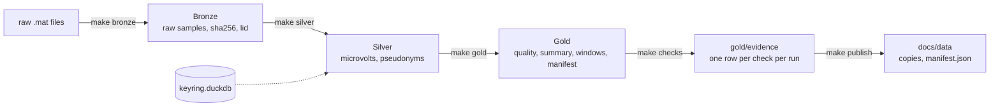
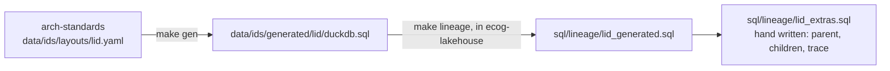

# Operating manual

Run, prove, inspect and reset the ecog-lakehouse demo, end to end, on this machine. Every command here was run before it was written. Only what is built is in this page; real data, faults and the browser page are in `doc/plan.md`.

## 0. The map



One line to remember: `make all SYNTH=1` runs the whole row, left to right, in under a minute.

## 1. Open a shell, once

From PowerShell:

```powershell
wsl
```

Then, inside WSL, every time:

```bash
cd /mnt/c/Prj/ecog-lakehouse
source ~/.venvs/ecog-lakehouse/bin/activate
export PATH=$HOME/.local/bin:$PATH
export DATA_DIR=$HOME/data/ecog-lakehouse
```

Done when this prints a version and no error:

```bash
make --version | head -1 && python -c "import duckdb; print(duckdb.__version__)"
```

Data never lives in the repository. `DATA_DIR` holds `raw/`, `bronze/`, `silver/`, `gold/` and `keyring.duckdb`. Only `docs/data/` is inside the repository, and git ignores it.

## 2. Build everything

```bash
make all SYNTH=1
```

What you see, in order: `convert: N rows written`, five `run: silver/...` lines, four `run: gold/...` lines, one `checks: run ..., {'pass': N, 'fail': 0, 'error': 0}`, one `publish: N files`.

Done when `fail` and `error` are both 0 and `publish` printed a manifest path.

Running it again is safe. Bronze skips every file it has already seen (by sha256), Silver and Gold are rebuilt, evidence gets one more run appended.

## 3. Prove it

```bash
make lint && make test
```

Done when the last line says `passed` and nothing says `failed`. Lint checks Python with ruff and every document for dashes and filler words.

## 4. Look inside

Each snippet opens a connection with every dataset as a view and the `lid` macros loaded, then asks one question.

### 4.1 Trace one Gold number back to its file

```bash
python3 - <<'EOF'
from pipeline import db
con = db.connect()
lid, rms = con.execute("SELECT lid, rms_uv FROM gold_channel_quality LIMIT 1").fetchone()
print("rms_uv", rms, "lid", con.execute("SELECT lid_text(lid_from_uuid(?))", [lid]).fetchone()[0])
print(con.sql("SELECT source_path, sha256, experiment, run, channel FROM lid_trace(?)", params=[lid]))
EOF
```

You get the source file, its sha256 from the ingest audit, and the run and channel the number came from. No join was needed for the decode; the file path comes from `lineage_dim`.

### 4.2 The evidence of the last run

```bash
python3 - <<'EOF'
from pipeline import db
print(db.connect().sql("""
SELECT framework, result, count(*) AS checks
FROM gold_evidence
WHERE run_id = (SELECT max(run_id) FROM gold_evidence)
GROUP BY ALL ORDER BY 1, 2"""))
EOF
```

Frameworks are the rows of `governance/requirements.csv` plus `contract`, the checks derived from `contracts/*.yaml`.

### 4.3 The canary

```bash
python3 - <<'EOF'
from pipeline import db
print(db.connect().sql("""
SELECT count(*) FILTER (WHERE lid_radioactive(lid_from_uuid(lid)) = 1) AS canary_in_silver,
       (SELECT count(*) FROM gold_channel_quality
        WHERE lid_radioactive(lid_from_uuid(lid)) = 1) AS canary_in_gold
FROM silver_record"""))
EOF
```

Expected: a positive number in Silver, 0 in Gold. The flag is a bit inside the identifier, so a copied row keeps it.

### 4.4 What this build is made of

```bash
python3 -c "from pipeline import db; print(db.connect().sql('SELECT dataset, n_records, dataset_version FROM gold_dataset_manifest ORDER BY 1'))"
```

One row per dataset. `dataset_version` is the same digest the evidence rows carry, so a registry can hold one row and name exactly this data.

## 5. One layer at a time

| Command | Writes | Under `DATA_DIR` |
|---|---|---|
| `make synth` | synthetic `.mat` files, kept if present | `raw/synthetic/<experiment>/<subject>.mat` |
| `make bronze SYNTH=1` | raw samples, electrodes, events, ingest audit | `bronze/<dataset>/...` |
| `make silver` | pseudonymised, typed layer, plus the keyring | `silver/<dataset>/...`, `keyring.duckdb` |
| `make gold` | quality, summary, windows, dataset manifest | `gold/<dataset>/data_0.parquet` |
| `make checks` | one evidence file per run, never rewritten | `gold/evidence/run_id=<ulid>/` |
| `make publish` | copies of Gold and `manifest.json` | `docs/data/` in the repository |

Each layer reads the one before it. Run them in this order or use `make all`.

## 6. Change the identifier layout

The `lid` bit layout lives in arch-standards, not here. The macros are generated there and copied.



```bash
cd /mnt/c/Prj/arch-standards && source ~/.venvs/arch/bin/activate && make test
cd /mnt/c/Prj/ecog-lakehouse && source ~/.venvs/ecog-lakehouse/bin/activate && make lineage && make test
```

Never edit `lid_generated.sql`. A layout change is a decision: it needs an ADR in arch-standards, and every `lid` in `DATA_DIR` was built with the old layout, so reset (section 9) and rebuild.

## 7. Add a governance rule

1. Add one row to `governance/requirements.csv`: framework, requirement id, clause, control, check kind, dataset, params as JSON.
2. `make checks`.
3. Read the evidence (section 4.2). A failing rule blocks `make all`; that is the point.

Check kinds and their params:

| Kind | Params | Passes when |
|---|---|---|
| `not_null` | `{"column": "c"}` | no NULL in `c` |
| `unique` | `{"columns": ["a", "b"]}` | no duplicate across the columns |
| `row_count_min` | `{"min": n}` | at least `n` rows |
| `no_direct_identifier` | `{"forbidden_columns": ["subject_src"]}` | none of the columns exist |
| `hash_match` | `{}` | every audit sha256 matches the file on disk |
| `partition_layout` | `{"max_rows_per_row_group": n, "min_row_groups": n}` | Parquet metadata within bounds |
| `retention` | `{"max_age_days": n}` | oldest file younger than `n` days |
| `sql` | `{"sql": "SELECT ..."}` | the query returns zero rows |

`dataset` may be a glob such as `gold/*`. The generator refuses SQL that does not parse and predicates nested deeper than 32 levels.

## 8. Show it in five minutes

| Minute | Say | Run |
|---|---|---|
| 0 to 1 | Three layers, one command, every number traceable | `make all SYNTH=1` started before the talk, or show the last output |
| 1 to 2 | Governance executes: rows in a table became these checks | section 4.2 |
| 2 to 3 | Pick any number, get its file and hash, no join | section 4.1 |
| 3 to 4 | A planted record can never leak: the flag is in the id | section 4.3 |
| 4 to 5 | This is what a registry would hold | section 4.4 |

Keep one terminal, font large, the four snippets pasted in a scratch file ready to run.

## 9. Reset

Data only, the repository is untouched:

```bash
rm -rf "$DATA_DIR" docs/data/gold docs/data/manifest.json && mkdir -p "$DATA_DIR"
```

Then section 2.

## 10. When it breaks

| You see | Cause | Do |
|---|---|---|
| `make: command not found` | `~/.local/bin` not on PATH | the `export PATH` line of section 1 |
| `No module named duckdb` | venv not active | the `source` line of section 1 |
| `checks: fail ...` lines | a rule is violated | read the printed check id, then section 4.2 |
| `publish: refused, canary records in ...` | a Gold file holds a canary lid | a mart SQL lost its `lid_radioactive` filter; fix `sql/gold/`, `make gold publish` |
| `sha256 already ingested` for every file | expected on a rerun | nothing |
| `lid_relayer: layer bits do not match` | a loader read the wrong layer | the layer argument in that `sql/silver/` or `sql/gold/` file is wrong |
| `git status` shows `.parquet` or `.mat` | something wrote inside the repository | that is a bug; data belongs in `DATA_DIR` |
